```mermaid
graph TD
    A[HR initiates offboarding] --> B[Select employee from dropdown]
    B --> C[Set last work date]
    C --> D[Select reason: Resignation/Termination/etc]
    D --> E[Submit offboarding request]
    E --> F[System queries ProvisionedItem table]
    F --> G{Items found?}
    G -->|No| H[Show warning: No onboarding records found]
    H --> I[Offer manual checklist option]
    G -->|Yes| J[Generate reverse checklist]
    J --> K[Transform items with action verbs]
    K --> L[Active Directory Account → Deactivate AD Account]
    K --> M[Laptop Dell XPS → Collect Laptop Dell XPS]
    L --> N[Create offboarding workflow]
    M --> N
    N --> O[Assign tasks to same roles]
    O --> P[Tech support sees mirrored checklist]
    P --> Q[Tech checks off deprovisioning items]
    Q --> R[ProvisionedItem.deprovisionedAt updated]
    R --> S{All items deprovisioned?}
    S -->|No| T[Workflow shows incomplete]
    S -->|Yes| U[Employee status → DEPARTED]
```

# Employee Lifecycle Management System UI/UX Specification

This document defines the user experience goals, information architecture, user flows, and visual design specifications for Employee Lifecycle Management System's user interface. It serves as the foundation for visual design and frontend development, ensuring a cohesive and user-centered experience.

## Overall UX Goals & Principles

### Target User Personas

**1. HR Administrator (Primary Coordinator)**
- **Profile:** HR generalists managing 50-500+ employee transitions per year
- **Tech Savviness:** Moderate - comfortable with web applications
- **Primary Goals:** Initiate workflows quickly, track progress across all employees, ensure nothing falls through cracks
- **Pain Points:** Manual tracking in spreadsheets, chasing down incomplete tasks, lack of visibility
- **Success Metrics:** Can initiate onboarding in <5 minutes, real-time status visibility

**2. Tech Support Specialist (Provisioning Expert)**
- **Profile:** IT administrators handling account/equipment setup and deprovisioning
- **Tech Savviness:** High - technically proficient
- **Primary Goals:** Complete provisioning checklists accurately, avoid missing items, automate repetitive tasks
- **Pain Points:** Unclear requirements, missing items during offboarding, no record of what was provisioned
- **Success Metrics:** 100% checklist completion, zero orphaned accounts

**3. Line Manager (Team Lead)**
- **Profile:** Managers responsible for new employee details and team integration
- **Tech Savviness:** Moderate to high - varies by department
- **Primary Goals:** Provide employee context quickly, know when new hire is ready, minimal disruption to workflow
- **Pain Points:** Unclear what information is needed, no visibility into readiness status
- **Success Metrics:** Complete their portion in <10 minutes, visibility into team onboardings

**4. Finance/Support Staff (Task Completers)**
- **Profile:** Finance team handling payroll/benefits, various support roles
- **Tech Savviness:** Moderate
- **Primary Goals:** Complete assigned tasks efficiently, clear instructions
- **Pain Points:** Tasks get lost in email, unclear deadlines
- **Success Metrics:** Know exactly what to do, receive timely reminders

### Usability Goals

1. **Ease of Learning:** New users can complete their first task within 5 minutes without training
2. **Efficiency of Use:** Power users (HR admins) can initiate workflows and check status in <30 seconds
3. **Error Prevention:** Checklists cannot be skipped; mandatory fields clearly indicated; confirmation required for destructive actions
4. **Memorability:** Infrequent users (managers who onboard once/year) can return and complete tasks without relearning
5. **Satisfaction:** Interface feels professional, trustworthy, and reduces anxiety about forgotten tasks

### Design Principles

1. **Clarity over Cleverness** - Clear communication and obvious actions trump aesthetic innovation; users should never wonder "what do I do next?"

2. **Progressive Disclosure** - Show complexity only when needed; HR sees simple initiation form, admins see advanced template customization only when they navigate there

3. **Glanceable Status** - Any user can understand the current state of any workflow within 3 seconds (color-coded cards, progress bars, clear status badges)

4. **Error Prevention over Recovery** - Design prevents mistakes (disabled buttons until ready, clear validation, confirmation dialogs) rather than relying on undo

5. **Context-Aware Guidance** - Interface adapts to user role (managers see only their team, tech support sees detailed checklists, HR sees everything)

### Change Log

| Date | Version | Description | Author |
|------|---------|-------------|--------|
| 2025-10-16 | 1.0 | Initial UI/UX Specification | UX Expert - Sally |

---

## Information Architecture (IA)

### Site Map / Screen Inventory


### Navigation Structure

**Primary Navigation (Top Bar):**
- **Logo/App Name** (click returns to Dashboard)
- **Dashboard** - Main landing page with workflow pipeline
- **My Tasks** - Personal task list for current user
- **Reports** - Analytics and reporting (HR/Admin only)
- **Templates** - Template library and designer (HR/Admin only)
- **Settings** - System configuration (Admin only)
- **User Menu** (right corner):
  - User name with role badge
  - Profile
  - Help/Documentation
  - Logout

**Secondary Navigation (Left Sidebar - Collapsible):**
On Dashboard:
- **Active Workflows** (default view)
- **Completed Workflows**
- **My Team** (Managers only - filtered view)

On Reports:
- **Completion Times**
- **SLA Compliance**
- **User Activity**
- **Security Compliance**

On Templates:
- **All Templates**
- **Onboarding Templates**
- **Offboarding Templates**
- **Create New** (future)

On Settings:
- **Users & Roles**
- **Audit Logs**
- **Email Configuration**
- **System Health**

**Breadcrumb Strategy:**
- **Show breadcrumbs** on all screens except Dashboard (which is home)
- **Format:** Dashboard > Workflow: John Smith (Developer Onboarding) > Task: Tech Support Provisioning
- **Interactive:** Each breadcrumb level is clickable to navigate back
- **Context-Aware:** For deep navigation (Template Editor > Task Config > Custom Fields), breadcrumbs prevent users from getting lost

**Quick Actions (Floating):**
- **"+ Initiate Onboarding"** button (HR Admin only) - visible on Dashboard, fixed position top-right
- **"+ Initiate Offboarding"** button (HR Admin only) - secondary action in dropdown
- These persist across Dashboard views for quick access

**Mobile/Tablet Navigation Adaptation:**
- Primary navigation collapses to hamburger menu on <768px width
- Sidebar slides out from left with overlay
- Breadcrumbs show only current page on mobile (tap to see full path)
- Quick action button remains visible but may stack vertically

---

## User Flows

### Flow 1: HR Initiates Employee Onboarding

**User Goal:** HR Administrator needs to start the onboarding process for a new employee joining the company

**Entry Points:**
- Dashboard "Initiate New Onboarding" button (primary)
- Dashboard menu > Initiate Onboarding
- Email link from hiring system (future integration)

**Success Criteria:**
- Workflow created with all tasks assigned
- Manager receives task notification email
- Dashboard shows new workflow card in "Not Started" column

#### Flow Diagram


#### Edge Cases & Error Handling

- **Duplicate Email:** If employee email already exists, show error: "An employee with this email already exists. Email: john@company.com (Status: Active). Do you want to view their record?"
- **Manager Not Found:** If selected manager is inactive/deleted, show error: "Selected manager is no longer active. Please choose a different manager."
- **Template Unavailable:** If selected template is inactive, show error: "This template is no longer available. Please contact an administrator."
- **Network Failure During Submit:** Show error with retry option: "Unable to create workflow. Please check your connection and try again." (Save draft locally if possible)
- **Session Timeout:** If session expires during form completion, redirect to login with return URL to preserve form data
- **Start Date in Past:** Warn user: "Start date is in the past. Are you sure this is correct?" (Allow override for backdated onboarding)

**Notes:** Form should auto-save to draft every 30 seconds to prevent data loss. Template selection should show preview of tasks that will be created.

---

### Flow 2: Tech Support Completes Provisioning Checklist

**User Goal:** Tech Support needs to provision accounts and equipment for new employee, ensuring nothing is missed

**Entry Points:**
- Email notification with "View Task" link
- Dashboard > Task card click
- My Tasks list > Task click

**Success Criteria:**
- All required checklist items checked off
- Notes added for items requiring context
- ProvisionedItem records created for offboarding
- Task marked complete, workflow progresses

#### Flow Diagram


#### Edge Cases & Error Handling

- **Unchecking Item:** If user unchecks a previously checked item, show warning: "Are you sure you want to uncheck this item? This will remove it from the provisioning log."
- **Missing Notes on Critical Items:** For items like "Active Directory Account", suggest adding notes: "Consider adding the account username for future reference."
- **Partial Completion:** If user navigates away with incomplete checklist, show dialog: "You have 5 uncompleted items. Your progress has been saved and you can return later."
- **Concurrent Editing:** If another user modifies the same task, show alert: "This task was updated by [User Name] 2 minutes ago. Refresh to see latest?"
- **Submission Failure:** If backend fails to save, show error: "Unable to complete task. Your checklist progress has been saved. Please try again."
- **Item Not Applicable:** For items user cannot complete (e.g., hardware not available), provide "Flag for Review" option to escalate to supervisor

**Notes:** Checklist should show timestamp and user who checked each item. Consider adding "Bulk Check" for admin accounts that are always provisioned together (e.g., AD + Email + VPN).

---

### Flow 3: Manager Views Team Onboarding Progress

**User Goal:** Manager wants to check the status of their new team member's onboarding to know when they'll be ready

**Entry Points:**
- Dashboard (default view shows "My Team" for managers)
- Email notification digest: "Daily onboarding summary"
- Direct link from manager's email to specific workflow

**Success Criteria:**
- Manager sees all their team's active onboardings
- Clear visual indication of progress and blockers
- Ability to drill into details if needed

#### Flow Diagram


#### Edge Cases & Error Handling

- **No Team Members:** If manager has no direct reports, show message: "You don't have any team members with active onboardings. Check with HR if this seems incorrect."
- **Permission Error:** If manager tries to view another manager's team member, show 403: "You don't have permission to view this workflow."
- **Workflow Stuck:** If workflow has no activity for 7+ days, show warning badge: "No activity for 7 days. Consider following up with [Assigned User]."
- **All Complete:** If all team onboardings are complete, show success state: "All team onboardings complete! Great job."
- **Filter Applied:** If manager searches and gets zero results, show: "No workflows match '[search term]'. Try adjusting your search."

**Notes:** Consider adding "Expected Completion Date" prominently on cards so managers can plan for new hire's first day. Add quick actions like "Send Reminder" to nudge task owners.

---

### Flow 4: Offboarding Mirror Generation (Automated)

**User Goal:** System automatically creates offboarding checklist from onboarding records to ensure complete deprovisioning

**Entry Points:**
- HR clicks "Initiate Offboarding" for departing employee
- Automated trigger from HRIS (future integration)

**Success Criteria:**
- Offboarding workflow created with tasks
- Tech support offboarding checklist mirrors onboarding items exactly
- All provisioned items listed for deprovisioning
- Zero orphaned accounts risk

#### Flow Diagram



#### Edge Cases & Error Handling

- **No Onboarding Records:** If employee was hired before system implementation, show: "No system records found for this employee. You can manually add provisioned items or use a blank checklist."
- **Partial Records:** If some items are already deprovisioned, show: "3 items already deprovisioned. Offboarding checklist will include only 6 remaining items."
- **Employee Not Active:** If trying to offboard non-active employee, show error: "This employee's status is [DEPARTED/PENDING]. Only ACTIVE employees can be offboarded."
- **Urgent Offboarding:** Offer "Emergency Offboarding" option that immediately disables critical accounts (AD, Email, VPN) then handles full cleanup later
- **Equipment Not Collected:** If offboarding task complete but hardware items not checked, block completion: "Hardware items not marked as collected. Please verify equipment return before closing."

**Notes:** This is the key innovation - the "offboarding mirror" ensures security. Consider adding a "Preview" step showing exactly what will be deprovisioned before creating workflow.

---

## Wireframes & Mockups

### Primary Design Files

**Design Tool:** Figma (recommended) or Sketch

**Repository Structure:**
- **High-Fidelity Designs:** To be created in Figma after this specification is approved
- **Design System Library:** Component library with reusable UI elements
- **Prototype:** Interactive prototype for user testing and stakeholder demos
- **Wireframes:** Low-fidelity layouts provided below for immediate development context

**Access:** Design files will be shared with development team via Figma project link (TBD)

**Sync Strategy:** Design system tokens (colors, spacing, typography) will be exported as CSS variables/JSON for frontend implementation

---

### Key Screen Layouts

This section provides low-fidelity wireframe descriptions for the 8 core screens identified in the PRD. These serve as immediate guidance for development; high-fidelity visual designs will follow in Figma.

---

#### 1. Login Screen

**Purpose:** Authenticate users and route them to their role-appropriate dashboard view

**Key Elements:**
- **Company Logo** - Centered at top (120px height)
- **Login Form Card** - Centered vertically and horizontally (400px width)
  - Email input field (with validation icon)
  - Password input field (with show/hide toggle)
  - "Remember Me" checkbox
  - "Forgot Password?" link (right-aligned, subtle)
  - "Sign In" primary button (full-width, disabled until valid)
- **Error Message Area** - Below form, red background, appears only on auth failure
- **Footer** - Copyright, Privacy Policy, Terms of Service links

**Layout:**
```
┌─────────────────────────────────────────┐
│                                         │
│            [Company Logo]               │
│                                         │
│    ┌───────────────────────────┐       │
│    │  Email                    │       │
│    │  [________________] ✓     │       │
│    │                           │       │
│    │  Password                 │       │
│    │  [________________] 👁    │       │
│    │                           │       │
│    │  ☐ Remember Me            │       │
│    │          Forgot Password? │       │
│    │                           │       │
│    │  [    Sign In    ]        │       │
│    └───────────────────────────┘       │
│                                         │
│     © 2025 | Privacy | Terms           │
└─────────────────────────────────────────┘
```

**Interaction Notes:**
- Email validation happens on blur (show error if invalid format)
- Password field reveals complexity requirements on focus
- Sign In button shows loading spinner during authentication
- On successful login, fade to dashboard (no jarring redirect)

**Responsive Behavior:**
- Card width reduces to 90% on mobile (<768px)
- Logo size scales down to 80px on mobile
- "Remember Me" and "Forgot Password" stack vertically on narrow screens

**Design File Reference:** `Login.fig` (to be created)

---

#### 2. Main Dashboard (Workflow Pipeline View)

**Purpose:** Provide at-a-glance status of all workflows with Kanban-style pipeline visualization

**Key Elements:**
- **Top Bar** (fixed position)
  - App logo/name (left)
  - Primary navigation: Dashboard | My Tasks | Reports | Templates | Settings
  - User menu with avatar and role badge (right)
  - Notification bell icon with unread count
- **Action Bar** (below top bar)
  - "+ Initiate Onboarding" button (primary, green)
  - "+ Initiate Offboarding" button (secondary, orange, in dropdown)
  - Search/filter controls (employee name, date range, workflow type)
  - View toggle: Kanban | List | Calendar (future)
- **Kanban Pipeline** (main content area)
  - 4 Columns: "Not Started" | "In Progress" | "Waiting" | "Completed"
  - Each column header shows count badge
  - Workflow cards (150px width minimum, fluid height)
- **Left Sidebar** (collapsible, 240px)
  - "Active Workflows" (selected by default)
  - "Completed Workflows"
  - "My Team" (Managers only)
  - Divider
  - Quick filters: Overdue | Due Today | Unassigned

**Workflow Card Anatomy:**
```
┌────────────────────────┐
│ 🟢 John Smith         │ ← Status indicator + Name
│ Developer Onboarding  │ ← Workflow type
│                       │
│ Progress: ████░░░ 60% │ ← Visual progress bar
│                       │
│ 👤 Sarah (Manager)    │ ← Current task owner
│ ⏰ Due: Oct 25        │ ← Due date (red if overdue)
│                       │
│ [View Details →]      │ ← Action link
└────────────────────────┘
```

**Layout:**
```
┌─────────────────────────────────────────────────────────┐
│ [Logo] Dashboard | My Tasks | Reports | Templates | ⚙  │ ← Top Nav
│                                         [🔔3] [👤User]  │
├─────────────────────────────────────────────────────────┤
│ [+ Initiate Onboarding ▼] [Search...] [Filters]        │ ← Action Bar
├──────┬──────────────────────────────────────────────────┤
│Active│  Not Started  │ In Progress  │ Waiting │Complete│
│──────│      (3)      │     (7)      │  (2)    │  (15)  │
│Comp..│               │              │         │        │
│My Tea│  [Card]       │  [Card]      │ [Card]  │ [Card] │
│      │  [Card]       │  [Card]      │ [Card]  │ [Card] │
│──────│  [Card]       │  [Card]      │         │ [Card] │
│[Filt]│               │  [Card]      │         │ ...    │
│Overdu│               │  [Card]      │         │        │
│Due To│               │  ...         │         │        │
│Unassi│               │              │         │        │
└──────┴──────────────────────────────────────────────────┘
```

**Interaction Notes:**
- **Drag & Drop:** Cards can be dragged between columns (status update confirmation)
- **Card Click:** Opens Workflow Detail View in modal or slide-in panel
- **Column Scroll:** Each column scrolls independently (virtualized for performance)
- **Real-time Updates:** New workflows appear with subtle animation, status changes highlight briefly
- **Empty State:** Show encouraging message: "No workflows in this stage. Great work!" with illustration

**Responsive Behavior:**
- Sidebar collapses to hamburger menu on tablet (<1024px)
- Kanban columns stack vertically on mobile (<768px) with horizontal scroll
- Cards become full-width on mobile
- Search/filter collapse to expandable panel

**Design File Reference:** `Dashboard-Kanban.fig` (to be created)

---

#### 3. Task Detail View (Multi-Variant)

**Purpose:** Allow users to complete their assigned tasks (form input, checklist, or approval)

This screen has **3 variants** based on task type:

##### Variant A: Form Completion (Manager Employee Details)

**Key Elements:**
- **Header Bar**
  - Breadcrumb: Dashboard > Workflow: John Smith > Task: Employee Details
  - Task status badge: "Assigned to You"
  - Due date indicator (red if overdue, yellow if due within 24h)
- **Progress Indicator** - Shows task position in workflow (e.g., "Step 1 of 5")
- **Form Fields** (arranged in 2-column grid on desktop)
  - Employee Name, Start Date, Department, Job Title, Manager, Location
  - Each field with clear label, placeholder, and validation rules
  - Required fields marked with red asterisk
  - Inline validation errors appear on blur
- **Help Text** - Contextual tips appear next to complex fields
- **Action Buttons** (bottom-right)
  - "Save Draft" (secondary, saves progress)
  - "Submit" (primary, disabled until all required fields valid)

**Layout:**
```
┌───────────────────────────────────────────────────────────┐
│ Dashboard > Workflow: John Smith > Task: Employee Details│
│ [Assigned to You] [Due: Oct 25, 2025]                    │
├───────────────────────────────────────────────────────────┤
│ Progress: ●━━━━━ Step 1 of 5                             │
├───────────────────────────────────────────────────────────┤
│                                                           │
│ Employee Name *                  Start Date *            │
│ [_________________]              [__________] 📅         │
│                                                           │
│ Department *                     Job Title *             │
│ [_________________]              [_________________]     │
│                                                           │
│ Direct Manager *                 Location *              │
│ [_________________] 🔍           [_________________]     │
│                                                           │
│ Additional Notes                                         │
│ [________________________________________]               │
│ [________________________________________]               │
│                                                           │
│                                   [Save Draft] [Submit]  │
└───────────────────────────────────────────────────────────┘
```

##### Variant B: Checklist Completion (Tech Support Provisioning)

**Key Elements:**
- **Header Bar** - Same as Variant A
- **Progress Indicator** - Shows checklist completion: "6 of 9 items complete (67%)"
- **Progress Bar** - Visual representation filling left-to-right as items checked
- **Checklist Items** - Vertical list with checkboxes
  - Each item has: Checkbox, Item label, Notes field (expandable), Timestamp (once checked)
  - Checked items show subtle strikethrough and move to bottom (optional setting)
  - Unchecked items highlighted if critically important
- **Warning Banner** - Appears if user tries to submit incomplete: "3 items remain unchecked"
- **Action Buttons**
  - "Mark Complete" (primary, disabled until 100% checked)
  - "Flag for Review" (secondary, escalates if blocked)

**Layout:**
```
┌────────────────────────────────────────────────────────────┐
│ Dashboard > Workflow: John Smith > Task: Provisioning     │
│ [Assigned to You] [Due: Oct 25, 2025]                     │
├────────────────────────────────────────────────────────────┤
│ Progress: 6 of 9 items complete (67%)                     │
│ ████████████████████░░░░░░░░░                             │
├────────────────────────────────────────────────────────────┤
│                                                            │
│ ☑ Active Directory Account                                │
│   Notes: Created user jsmith@company.com                  │
│   ✓ Completed by Tech Support (Oct 22, 10:30 AM)          │
│                                                            │
│ ☑ Email Account                                           │
│   Notes: Mailbox provisioned                              │
│   ✓ Completed by Tech Support (Oct 22, 10:32 AM)          │
│                                                            │
│ ☐ Laptop - Dell XPS 15                                    │
│   [Add notes...] ▼                                         │
│                                                            │
│ ☐ VPN Access                                              │
│   [Add notes...] ▼                                         │
│                                                            │
│ ☐ GitHub Repository Access                                │
│   [Add notes...] ▼                                         │
│                                                            │
│ ... (3 more items)                                         │
│                                                            │
│                        [Flag for Review] [Mark Complete]  │
└────────────────────────────────────────────────────────────┘
```

**Interaction Notes:**
- **Checkbox Click:** Immediately saves state, shows timestamp, disables checkbox (with undo option for 5 seconds)
- **Notes Expansion:** Click arrow to expand textarea for detailed notes
- **Auto-save:** Notes auto-save after 2 seconds of inactivity
- **Confirmation Dialog:** On "Mark Complete", show: "Confirm all 9 items are provisioned? This cannot be undone."

##### Variant C: Approval View (Manager Approval)

**Key Elements:**
- **Header Bar** - Same as Variant A
- **Summary Panel** - Shows what is being approved (workflow summary, task completion status)
- **Approval Checklist** - Items to verify before approving
- **Comments Field** - Optional comments for approval/rejection
- **Action Buttons**
  - "Approve" (primary, green)
  - "Request Changes" (secondary, orange)
  - "Reject" (destructive, red)

**Responsive Behavior (All Variants):**
- Form fields stack to single column on mobile (<768px)
- Progress bar remains fixed at top when scrolling
- Action buttons become full-width on mobile
- Breadcrumbs show only current page title on mobile (tap to expand)

**Design File Reference:** `Task-Form.fig`, `Task-Checklist.fig`, `Task-Approval.fig` (to be created)

---

#### 4. Workflow Detail View

**Purpose:** Provide comprehensive view of a single workflow instance with timeline, tasks, employee info, and audit history

**Key Elements:**
- **Header Section**
  - Employee name (large, bold)
  - Workflow type badge (e.g., "Developer Onboarding")
  - Status indicator (color-coded: Green=Complete, Yellow=In Progress, Gray=Not Started, Red=Overdue)
  - Expected completion date
  - Action menu: "Send Reminder", "Pause Workflow", "Cancel Workflow"
- **Employee Information Card** (left sidebar, 320px)
  - Profile photo placeholder
  - Employee details: Email, Department, Manager, Start Date
  - "Edit Details" link (if user has permission)
- **Task Timeline** (main content area)
  - Vertical timeline with tasks arranged chronologically
  - Each task shows: Status icon, Task name, Assignee, Due date, Completion timestamp
  - Expandable task cards show checklist details or form responses
  - Visual line connecting tasks (color-coded by status)
- **Tabs** (below header)
  - "Timeline" (default view)
  - "Audit History" (who did what, when)
  - "Documents" (attachments, future feature)

**Task Timeline Layout:**
```
┌──────────────────────────────────────────────────────────┐
│ John Smith                    [Developer Onboarding] 🟡  │
│ Expected Completion: Oct 30, 2025            [⋮ Menu]    │
├──────────────┬───────────────────────────────────────────┤
│ Employee Info│ Timeline | Audit History | Documents      │
│──────────────│                                            │
│ [Photo]      │  ✓──[Manager: Employee Details]           │
│ John Smith   │  │   Completed by Sarah (Manager)         │
│              │  │   Oct 22, 9:00 AM                      │
│ jsmith@co... │  │                                         │
│ Engineering  │  ●──[HR: Employee Setup]                  │
│ Reports to:  │  │   In Progress - Assigned to HR Admin   │
│ Sarah Chen   │  │   Due: Oct 23                          │
│              │  │                                         │
│ Start Date:  │  ○──[Tech Support: Provisioning]          │
│ Oct 28, 2025 │  │   Not Started                          │
│              │  │   Assigned to Tech Support             │
│ [Edit]       │  │   Due: Oct 25                          │
│              │  │                                         │
│              │  ○──[Finance: Payroll Setup]              │
│              │  │   Not Started                          │
│              │      Due: Oct 27                          │
└──────────────┴───────────────────────────────────────────┘
```

**Timeline Item Icons:**
- ✓ (Green checkmark) = Complete
- ● (Yellow circle) = In Progress
- ○ (Gray circle) = Not Started
- ! (Red exclamation) = Overdue

**Interaction Notes:**
- **Task Click:** Expands task card to show full details inline
- **Assignee Click:** Opens user profile popover
- **"Send Reminder" Action:** Opens modal to send email reminder to task owner
- **Real-time Updates:** Timeline refreshes automatically when tasks are updated

**Responsive Behavior:**
- Employee info card moves above timeline on tablet (<1024px)
- Timeline becomes single column with reduced indentation
- Tabs convert to dropdown menu on mobile (<768px)

**Design File Reference:** `Workflow-Detail.fig` (to be created)

---

#### 5. Workflow Template Designer (Admin Only)

**Purpose:** Allow admins to create and customize workflow templates with tasks, conditional logic, and custom fields

**Key Elements:**
- **Template Metadata Panel** (top section)
  - Template Name input
  - Template Type dropdown (Onboarding | Offboarding)
  - Active/Inactive toggle
  - Version number (read-only)
- **Task Builder** (main content area)
  - Task list (left column, 320px)
    - Draggable task cards showing: Task name, Assignee role, Dependencies
    - "+ Add Task" button at bottom
  - Task Configuration Panel (right column, fills remaining space)
    - Task name input
    - Task type selector: Form | Checklist | Approval
    - Assignee role dropdown (HR_ADMIN, MANAGER, TECH_SUPPORT, etc.)
    - Due date formula (e.g., "Start Date + 2 days")
    - Dependencies: "This task cannot start until..." (multi-select)
    - Conditional logic builder: "Only include this task if..."
    - **Form Builder** (if type=Form): Add custom fields with validation rules
    - **Checklist Builder** (if type=Checklist): Add checklist items with provision tracking
- **Action Buttons** (top-right)
  - "Preview" (shows what workflow will look like for users)
  - "Save Draft"
  - "Publish" (makes template active)

**Layout:**
```
┌────────────────────────────────────────────────────────────┐
│ Template Name: [Developer Onboarding]  [Active ⚫]        │
│ Type: [Onboarding ▼]  Version: 2.0    [Preview] [Save]   │
├──────────────────┬─────────────────────────────────────────┤
│ Task List        │ Task Configuration                      │
│                  │                                         │
│ [≡] Manager      │ Task Name: [Employee Details Entry]    │
│  Employee Details│                                         │
│  👤 MANAGER      │ Task Type: ● Form ○ Checklist ○ Approval│
│                  │                                         │
│ [≡] HR Admin     │ Assigned to: [Manager ▼]               │
│  Employee Setup  │                                         │
│  👤 HR_ADMIN     │ Due Date: [Start Date + 0 days]        │
│                  │                                         │
│ [≡] Tech Support │ Dependencies:                           │
│  Provisioning    │ ☑ Manager: Employee Details            │
│  👤 TECH_SUPPORT │ ☐ HR Admin: Employee Setup             │
│                  │                                         │
│ [≡] Finance      │ Conditional Logic:                      │
│  Payroll Setup   │ [+ Add Condition]                      │
│  👤 FINANCE      │                                         │
│                  │ ──────────────────────────────          │
│ [+ Add Task]     │ Form Builder:                           │
│                  │ 1. Employee Name (Text, Required)       │
│                  │ 2. Start Date (Date, Required)          │
│                  │ 3. Department (Dropdown, Required)      │
│                  │ [+ Add Field]                           │
└──────────────────┴─────────────────────────────────────────┘
```

**Interaction Notes:**
- **Drag & Drop:** Reorder tasks by dragging in left column (affects default sequence)
- **Task Selection:** Click task in left column to load configuration in right panel
- **Dependency Visualization:** Show warning if circular dependencies detected
- **Preview Mode:** Opens modal showing workflow as end-users will see it

**Responsive Behavior:**
- Split view becomes tabbed interface on tablet: "Task List" tab | "Task Config" tab
- Form builder fields stack vertically on mobile
- Drag & drop replaced with "Move Up/Down" buttons on mobile

**Design File Reference:** `Template-Designer.fig` (to be created)

---

#### 6. Checklist Completion Interface

**Purpose:** Tech support-focused interface optimized for rapid checklist completion with provision tracking

**Note:** This is a specialized variant of Task Detail View (Variant B) with additional features for power users.

**Additional Features Beyond Task Detail View:**
- **Bulk Actions** - Select multiple items and check all at once (e.g., "Standard Developer Stack")
- **Provision Templates** - Pre-filled notes for common scenarios (e.g., "AD Account: {{employee_email}}")
- **Quick Notes Panel** - Common notes snippets available as buttons (e.g., "Account created", "Laptop assigned")
- **Keyboard Shortcuts** - Space to check, Tab to next item, Ctrl+Enter to submit
- **History View** - Shows previous checklists for this employee (if offboarding)

**Layout Enhancement:**
```
┌────────────────────────────────────────────────────────────┐
│ Provisioning Checklist: John Smith (Developer)            │
│ Progress: 6/9 complete (67%)  ████████░░░░                │
├────────────────────────────────────────────────────────────┤
│ Quick Notes: [Account created] [Laptop assigned] [N/A]    │
├────────────────────────────────────────────────────────────┤
│ ☐ Active Directory Account                                │
│   Template: [Standard AD Account ▼]                       │
│   Notes: [Username: jsmith@company.com]                   │
│                                                            │
│ ☐ Email Account (linked to AD)                            │
│ ☐ Laptop - Dell XPS 15                                    │
│   ... (6 more items)                                       │
│                                                            │
│ [▣ Bulk Check: Developer Stack]       [Mark Complete]    │
└────────────────────────────────────────────────────────────┘
```

**Design File Reference:** `Checklist-Advanced.fig` (to be created)

---

#### 7. Reports Screen

**Purpose:** Provide analytics and insights on workflow performance, SLA compliance, and system usage

**Key Elements:**
- **Report Type Selector** (left sidebar, 240px)
  - Completion Times
  - SLA Compliance
  - User Activity
  - Security Compliance (Offboarding Mirror Audit)
- **Date Range Selector** (top of main content)
  - Presets: Last 7 days | Last 30 days | Last Quarter | Custom Range
- **Summary Cards** (top section, 4-column grid)
  - Total Workflows: 147
  - Average Completion Time: 4.2 days
  - SLA Compliance Rate: 94%
  - Overdue Tasks: 8
- **Primary Chart** (main content area)
  - Line chart, bar chart, or table depending on report type
  - Interactive tooltips on hover
  - Legend with color coding
- **Export Options** (top-right)
  - "Export to CSV", "Export to PDF", "Schedule Email Report"

**Layout:**
```
┌──────────────┬──────────────────────────────────────────────┐
│ Report Types │ Date Range: [Last 30 Days ▼]    [Export ▼]  │
│──────────────│                                               │
│▶ Completion  │ ┌──────┐┌──────┐┌──────┐┌──────┐            │
│  Times       │ │ 147  ││ 4.2  ││ 94%  ││  8   │            │
│  SLA Comp... │ │Total ││Avg   ││SLA   ││Over- │            │
│  User Act... │ │Workf.││Days  ││Comp. ││due   │            │
│  Security... │ └──────┘└──────┘└──────┘└──────┘            │
│              │                                               │
│              │ Completion Time Trend                        │
│              │ ┌────────────────────────────────────────┐   │
│              │ │         ╱╲                             │   │
│              │ │      ╱─╯  ╲╲                           │   │
│              │ │   ╱─╯      ╲╲                          │   │
│              │ │ ─╯          ╲╲╱╲                       │   │
│              │ │              ╲╯  ─────                 │   │
│              │ └────────────────────────────────────────┘   │
│              │  Week 1  Week 2  Week 3  Week 4          │   │
│              │                                               │
│              │ Detailed Data Table                          │
│              │ ┌──────────────────────────────────────┐     │
│              │ │ Employee │ Type │ Days │ Status      │     │
│              │ │──────────┼──────┼──────┼─────────────│     │
│              │ │ J.Smith  │ Onb. │ 3.5  │ Complete    │     │
│              │ │ M.Jones  │ Offb.│ 2.1  │ Complete    │     │
│              │ │ ...      │ ...  │ ...  │ ...         │     │
└──────────────┴──────────────────────────────────────────────┘
```

**Interaction Notes:**
- **Chart Interaction:** Click data points to drill down to workflow list
- **Table Sorting:** Click column headers to sort ascending/descending
- **Export:** Generate report with current filters applied

**Responsive Behavior:**
- Report type sidebar collapses to dropdown on tablet (<1024px)
- Summary cards stack to 2-column then 1-column on mobile
- Charts become scrollable horizontally on narrow screens
- Table becomes horizontally scrollable with fixed first column

**Design File Reference:** `Reports.fig` (to be created)

---

#### 8. Settings/Admin Screen

**Purpose:** System configuration, user management, audit logs, and email settings (Admin only)

**Key Elements:**
- **Settings Navigation** (left sidebar, 240px)
  - Users & Roles
  - Audit Logs
  - Email Configuration
  - System Health
  - Integration Settings (future)
- **Main Content Area** (varies by section)

**Users & Roles Section:**
- User list table: Name, Email, Role, Status, Last Login, Actions
- "+ Add User" button
- Role badge color coding: HR_ADMIN (blue), MANAGER (green), TECH_SUPPORT (purple), etc.
- "Edit" and "Deactivate" actions per user

**Audit Logs Section:**
- Filter controls: Date range, User, Action type
- Log table: Timestamp, User, Action, Details, IP Address
- Real-time updates with WebSocket (new entries appear at top with highlight)

**Email Configuration Section:**
- SMTP settings form: Host, Port, Username, Password (masked)
- "Test Connection" button
- Email template editor (for notification customization)

**System Health Section:**
- Health indicators: Database (🟢), Email Service (🟢), Background Jobs (🟡)
- Recent errors list
- Performance metrics: Response time, Active users, Workflow queue depth

**Layout (Users & Roles):**
```
┌──────────────┬──────────────────────────────────────────────┐
│ Settings     │ User Management              [+ Add User]    │
│──────────────│                                               │
│▶ Users &     │ ┌────────────────────────────────────────┐   │
│  Roles       │ │ Name     │Email    │Role    │Status  │   │   │
│  Audit Logs  │ │──────────┼─────────┼────────┼────────┼───│   │
│  Email Config│ │ Sarah C. │sarah@.. │HR_ADMIN│Active  │Edit│   │
│  System      │ │ Mike T.  │mike@... │TECH_SUP│Active  │Edit│   │
│  Health      │ │ Lisa M.  │lisa@... │MANAGER │Active  │Edit│   │
│              │ │ ...      │ ...     │ ...    │ ...    │... │   │
│              │ └────────────────────────────────────────────┘   │
│              │                                               │
│              │ Role Definitions                             │
│              │ ┌────────────────────────────────────────┐   │
│              │ │ HR_ADMIN                               │   │
│              │ │ Can initiate workflows, manage users,  │   │
│              │ │ view all reports, configure templates  │   │
│              │ │                        [Edit Role]     │   │
│              │ └────────────────────────────────────────┘   │
└──────────────┴──────────────────────────────────────────────┘
```

**Interaction Notes:**
- **User Add/Edit:** Modal form with role assignment and permission preview
- **Audit Log Streaming:** New entries appear in real-time without page refresh
- **Email Test:** Shows success/failure message with diagnostic details

**Responsive Behavior:**
- Settings sidebar converts to dropdown on mobile (<768px)
- User table becomes card-based layout on mobile
- Form fields stack to single column

**Design File Reference:** `Settings.fig` (to be created)

---

### Wireframe Delivery Notes

**Low-Fidelity → High-Fidelity Transition:**
- These ASCII/text wireframes provide immediate context for development team
- High-fidelity visual designs with accurate spacing, colors, and interactions will be created in Figma
- Design system components (buttons, inputs, cards) will be standardized in Figma library
- Interactive prototypes will be built for user testing before development begins

**Next Steps:**
1. Review and approve these wireframe concepts
2. Create Figma project with design system library
3. Build high-fidelity mockups for each screen
4. Conduct user testing with clickable prototypes
5. Iterate based on feedback
6. Hand off final designs to development team with design tokens and component specifications

---

## Component Library / Design System

### Design System Philosophy

**Consistency Over Customization**: Every instance of a button, input field, or card should behave identically across the application. This reduces cognitive load and allows users to transfer learned behaviors between screens.

**Atomic Design Methodology**: Components are organized in a hierarchy from smallest (atoms) to largest (templates):
- **Atoms**: Basic building blocks (buttons, inputs, labels, icons)
- **Molecules**: Simple component groups (search bar = input + button, form field = label + input + error message)
- **Organisms**: Complex UI sections (navigation bar, workflow card, task timeline)
- **Templates**: Page-level layouts (dashboard template, detail view template)

**Accessibility-First**: Every component is designed with WCAG AA compliance built-in (keyboard navigation, ARIA labels, sufficient color contrast, screen reader support).

**Token-Based**: All design decisions (colors, spacing, typography, shadows) are defined as tokens that can be exported to CSS variables or JSON for frontend implementation.

---

### Component Inventory

This section catalogs all reusable UI components identified from the 8 wireframe screens. Each component includes: purpose, variants, states, and implementation notes.

---

#### Atoms (Basic Building Blocks)

##### 1. Button

**Purpose**: Trigger actions throughout the application

**Variants**:
- **Primary**: High-emphasis actions (e.g., "Submit", "Mark Complete", "Initiate Onboarding")
  - Background: Brand primary color
  - Text: White
  - Use: 1 per screen section maximum
- **Secondary**: Medium-emphasis actions (e.g., "Save Draft", "Cancel")
  - Background: Transparent
  - Border: 1px solid neutral-400
  - Text: Neutral-700
- **Destructive**: Dangerous actions (e.g., "Reject", "Delete", "Deactivate")
  - Background: Red-600
  - Text: White
  - Requires confirmation dialog
- **Ghost**: Tertiary actions (e.g., "Learn More", "Skip")
  - Background: Transparent
  - No border
  - Text: Brand primary color
- **Icon Button**: Actions with icon only (e.g., notification bell, user menu)
  - Size: 40x40px
  - Icon: 20x20px
  - Padding: 10px

**States**:
- Default
- Hover (darken background 10%)
- Active/Pressed (darken background 15%)
- Disabled (opacity 40%, cursor not-allowed)
- Loading (spinner replaces text, maintains size)

**Sizing**:
- Small: 32px height, 12px padding, 14px font
- Medium: 40px height, 16px padding, 16px font (default)
- Large: 48px height, 20px padding, 18px font

**Implementation Notes**:
- Use `<button>` element (not `<div>` with click handler) for accessibility
- Include `aria-label` for icon-only buttons
- Loading state must announce "Loading" to screen readers
- Keyboard: Space/Enter to activate, Tab to navigate

---

##### 2. Input Field

**Purpose**: Collect text, numbers, dates, and selections from users

**Variants**:
- **Text Input**: Single-line text entry
- **Text Area**: Multi-line text entry (auto-expanding or fixed height)
- **Number Input**: Numeric values with optional increment/decrement buttons
- **Date Picker**: Calendar selector (integration with browser native or library like react-datepicker)
- **Dropdown/Select**: Single-selection from list of options
- **Multi-Select**: Multiple selections with chips/tags
- **Search Input**: Text input with search icon and clear button
- **Password Input**: Masked text with show/hide toggle

**States**:
- Default (empty)
- Filled (with value)
- Focus (blue border highlight, 2px)
- Error (red border, error message below)
- Disabled (gray background, cursor not-allowed)
- Read-only (no border, gray text)

**Anatomy**:
```
┌─────────────────────────────────────┐
│ Label *                             │ ← Label with asterisk if required
│ ┌─────────────────────────────────┐ │
│ │ Placeholder text...             │ │ ← Input field
│ └─────────────────────────────────┘ │
│ Helper text or validation error     │ ← Contextual message
└─────────────────────────────────────┘
```

**Sizing**:
- Small: 32px height
- Medium: 40px height (default)
- Large: 48px height

**Validation**:
- Inline validation on blur (not on every keystroke to avoid frustration)
- Success state (green checkmark icon) for valid critical fields (email, username)
- Error state shows icon + message: "Please enter a valid email address"

**Implementation Notes**:
- Use semantic HTML (`<input type="email">`, `<input type="date">`, etc.)
- `aria-required="true"` for required fields
- `aria-invalid="true"` and `aria-describedby` linking to error message
- Label must use `<label>` element with `for` attribute (not placeholder as label)

---

##### 3. Checkbox

**Purpose**: Binary selection (yes/no, completed/incomplete)

**Variants**:
- **Standard**: Single checkbox with label
- **Indeterminate**: Partial selection state (for "select all" with some children selected)
- **With Description**: Checkbox with multi-line description below label

**States**:
- Unchecked (empty box)
- Checked (checkmark in box)
- Indeterminate (dash in box)
- Disabled (gray, non-interactive)
- Focus (blue outline for keyboard navigation)

**Sizing**:
- Checkbox: 20x20px
- Touch target: 44x44px (for mobile accessibility)
- Label: 16px font, 24px line height

**Visual Design**:
```
☐ Unchecked
☑ Checked
☑̶ Indeterminate
□̶ Disabled
```

**Implementation Notes**:
- Use `<input type="checkbox">` with custom styling
- `aria-checked="true|false|mixed"` for indeterminate state
- Entire label area should be clickable (not just checkbox)
- Keyboard: Space to toggle

---

##### 4. Badge

**Purpose**: Display status, counts, or categories with visual prominence

**Variants**:
- **Status Badge**: Workflow status (Not Started, In Progress, Completed, Overdue)
  - Gray: Not Started
  - Yellow: In Progress
  - Green: Completed
  - Red: Overdue
- **Role Badge**: User role indicators (HR_ADMIN, MANAGER, TECH_SUPPORT, FINANCE)
  - Blue: HR_ADMIN
  - Green: MANAGER
  - Purple: TECH_SUPPORT
  - Orange: FINANCE
- **Count Badge**: Notification counts (e.g., "3" on notification bell)
  - Red background, white text, circular
- **Category Badge**: Workflow type tags (Onboarding, Offboarding)
  - Neutral colors, rectangular with rounded corners

**States**:
- Static (no interaction)
- Clickable (optional, with hover effect)

**Sizing**:
- Small: 18px height, 8px padding, 12px font
- Medium: 24px height, 12px padding, 14px font (default)

**Implementation Notes**:
- Use `<span>` with semantic class names (not color-only distinction)
- Include text for screen readers: "Status: In Progress" (not just color)
- Count badges over 99 should show "99+"

---

##### 5. Icon

**Purpose**: Visual symbols for actions, status, and navigation

**Icon Library**: Choose one of:
- **Material Icons** (Google, comprehensive, free)
- **Heroicons** (Tailwind, modern, clean)
- **Lucide** (Feather fork, consistent stroke width)

**Usage Guidelines**:
- **Action Icons**: Always paired with text label or `aria-label` (search, edit, delete)
- **Status Icons**: Checkmark (complete), circle (in progress), exclamation (error), info (help)
- **Navigation Icons**: Arrows, hamburger menu, close (X)

**Sizing**:
- Small: 16x16px
- Medium: 20x20px (default for buttons)
- Large: 24x24px (default for navigation)

**Color**:
- Inherit from parent text color by default
- Status icons use semantic colors (green checkmark, red exclamation)

**Implementation Notes**:
- Use SVG (not icon fonts) for better accessibility and rendering
- Decorative icons: `aria-hidden="true"`
- Functional icons: `aria-label` describing action

---

#### Molecules (Simple Component Groups)

##### 6. Form Field

**Purpose**: Complete form input with label, field, validation, and help text

**Anatomy**:
- Label (with optional asterisk for required)
- Input field (any variant from Atom #2)
- Help text (optional, gray text below)
- Error message (red text below, appears on validation failure)
- Success indicator (green checkmark icon, optional)

**Behavior**:
- Validation triggers on blur
- Error message appears with 200ms fade-in
- Field remains in error state until valid value entered
- Required fields show asterisk in label

**Example**:
```
Employee Email *
┌─────────────────────────────────┐
│ john.smith@company.com      ✓  │
└─────────────────────────────────┘
Format: firstname.lastname@company.com
```

**Implementation Notes**:
- Use `<fieldset>` for grouped fields
- Error message linked with `aria-describedby`
- Help text always visible, error text appears on validation

---

##### 7. Search Bar

**Purpose**: Filter and search content across the application

**Anatomy**:
- Search icon (left side)
- Text input field
- Clear button (X icon, appears when text entered)
- Optional: Filter dropdown button (right side)

**States**:
- Empty (placeholder text: "Search employees, workflows...")
- Typing (show clear button)
- Results (optional dropdown with search suggestions)

**Behavior**:
- Debounced search (300ms delay after last keystroke)
- Clear button resets field and results
- Escape key clears field
- Enter key submits search (if different from live search)

**Implementation Notes**:
- Use `<input type="search">` for semantic HTML
- `role="search"` on container
- Live region (`aria-live="polite"`) to announce result counts

---

##### 8. Workflow Card

**Purpose**: Display workflow summary in dashboard Kanban view

**Anatomy** (from wireframes):
```
┌────────────────────────┐
│ 🟢 John Smith         │ ← Status indicator + Name
│ Developer Onboarding  │ ← Workflow type
│                       │
│ Progress: ████░░░ 60% │ ← Visual progress bar
│                       │
│ 👤 Sarah (Manager)    │ ← Current task owner
│ ⏰ Due: Oct 25        │ ← Due date
│                       │
│ [View Details →]      │ ← Action link
└────────────────────────┘
```

**Components Used**:
- Status badge (atom)
- Progress bar (atom)
- Icon (atom)
- Button/link (atom)

**States**:
- Default
- Hover (subtle shadow increase, background tint)
- Dragging (semi-transparent, follows cursor)
- Selected (blue border, for multi-select future feature)

**Responsive**:
- Desktop: 240px width (flexible height)
- Mobile: 100% width (full-width card)

**Implementation Notes**:
- Entire card clickable to open detail view
- Drag handle appears on hover (left edge)
- Use semantic HTML: `<article>` with heading for employee name

---

##### 9. Progress Bar

**Purpose**: Show task completion percentage visually

**Variants**:
- **Linear**: Horizontal bar (default)
- **Circular**: Radial progress (for compact spaces, future)

**Anatomy**:
```
Progress: 6 of 9 items complete (67%)
████████████████████░░░░░░░░░
```

**Components**:
- Label text (e.g., "6 of 9 items complete")
- Percentage text (e.g., "67%")
- Filled bar (brand primary color)
- Unfilled bar (neutral-200 background)

**States**:
- In Progress (0-99%): Blue fill
- Complete (100%): Green fill
- Overdue (<100% past due date): Red fill

**Implementation Notes**:
- Use `<progress>` element or `<div role="progressbar">`
- `aria-valuenow`, `aria-valuemin`, `aria-valuemax` attributes
- Announce percentage to screen readers

---

##### 10. Breadcrumb

**Purpose**: Show current location in navigation hierarchy

**Anatomy**:
```
Dashboard > Workflow: John Smith > Task: Employee Details
   ↑           ↑                         ↑
clickable   clickable                current page
```

**Behavior**:
- Each level is clickable (except current page)
- Separator: `>` or `/` character
- Current page: bold, not clickable

**Responsive**:
- Desktop: Show full path
- Mobile: Show only current page with back button (tap to expand full path)

**Implementation Notes**:
- Use `<nav aria-label="Breadcrumb">`
- Structured data: `<ol>` with `<li>` for each level
- Current page: `aria-current="page"`

---

#### Organisms (Complex UI Sections)

##### 11. Navigation Bar (Top Bar)

**Purpose**: Primary application navigation and user account access

**Anatomy**:
```
┌─────────────────────────────────────────────────────────┐
│ [Logo] Dashboard | My Tasks | Reports | Templates | ⚙  │
│                                         [🔔3] [👤User]  │
└─────────────────────────────────────────────────────────┘
```

**Components Used**:
- Logo (link to dashboard)
- Navigation links (buttons)
- Icon buttons (notifications, user menu)
- Badge (notification count)

**States**:
- Navigation link active (underline or background highlight)
- Notification bell: empty state vs. unread count
- User menu: collapsed vs. expanded dropdown

**Responsive**:
- Desktop: Full horizontal navigation
- Tablet: Some links move to hamburger menu
- Mobile: All navigation in hamburger menu

**Implementation Notes**:
- Use `<nav role="navigation">`
- Current page link: `aria-current="page"`
- Dropdown menus: `aria-expanded` and `aria-haspopup`

---

##### 12. Sidebar (Collapsible)

**Purpose**: Contextual navigation and filtering within a section

**Anatomy** (from Dashboard):
```
┌──────────────┐
│ Active       │ ← Selected
│ Completed    │
│ My Team      │
│──────────────│ ← Divider
│ Filters      │
│ Overdue      │
│ Due Today    │
│ Unassigned   │
└──────────────┘
```

**Components Used**:
- Navigation links (with selection state)
- Divider line
- Collapse/expand toggle button

**States**:
- Expanded (240px width on desktop)
- Collapsed (60px width, icons only)
- Hidden (mobile, accessible via hamburger menu)

**Behavior**:
- Persist collapse state in localStorage
- Smooth transition animation (200ms)

**Implementation Notes**:
- Use `<aside>` element
- `aria-expanded` on toggle button
- Selected link: `aria-current="page"` or visual highlight

---

##### 13. Data Table

**Purpose**: Display structured data with sorting, filtering, and actions

**Anatomy**:
```
┌────────────────────────────────────────────────────────┐
│ Name ↓    │ Email        │ Role     │ Status │ Actions │
│───────────┼──────────────┼──────────┼────────┼─────────│
│ Sarah C.  │ sarah@co.com │ HR_ADMIN │ Active │ [Edit]  │
│ Mike T.   │ mike@co.com  │ TECH_SUP │ Active │ [Edit]  │
└────────────────────────────────────────────────────────┘
```

**Features**:
- **Column Headers**: Clickable to sort (ascending/descending)
- **Row Hover**: Highlight row on hover
- **Row Actions**: Edit, delete, or custom actions per row
- **Empty State**: Show message when no data
- **Pagination**: For large datasets (optional)

**Responsive**:
- Desktop: Full table
- Tablet: Horizontal scroll
- Mobile: Card-based layout (one card per row)

**Implementation Notes**:
- Use `<table>` with `<thead>`, `<tbody>`, `<th>`, `<td>`
- Sort: `aria-sort="ascending|descending|none"` on headers
- Row actions: `aria-label` for context (e.g., "Edit Sarah Chen")

---

##### 14. Modal Dialog

**Purpose**: Display content or forms overlaying the main interface

**Use Cases**:
- Confirmation dialogs (e.g., "Are you sure you want to mark complete?")
- Forms (e.g., "Add New User")
- Detail views (e.g., expanded workflow details)

**Anatomy**:
```
┌─────────────────────────────────────────────┐
│ [Modal Title]                          [X]  │ ← Header
│─────────────────────────────────────────────│
│                                             │
│ Modal content goes here...                  │ ← Body
│                                             │
│─────────────────────────────────────────────│
│                     [Cancel] [Confirm]      │ ← Footer
└─────────────────────────────────────────────┘
    ↑ Background overlay (semi-transparent)
```

**Behavior**:
- Appears with fade-in animation (200ms)
- Focus traps within modal (Tab cycles through modal elements only)
- Escape key closes modal (unless confirmation required)
- Click outside closes modal (unless unsaved changes)

**Sizing**:
- Small: 400px width (confirmations)
- Medium: 600px width (forms)
- Large: 800px width (detail views)
- Full-screen: Mobile only

**Implementation Notes**:
- Use `<dialog>` element or `role="dialog"`
- `aria-modal="true"` and `aria-labelledby` for title
- Focus first interactive element on open
- Return focus to trigger element on close

---

##### 15. Toast Notification

**Purpose**: Display temporary success, error, or info messages

**Variants**:
- **Success**: Green background, checkmark icon (e.g., "Task completed successfully")
- **Error**: Red background, exclamation icon (e.g., "Failed to save. Please try again.")
- **Warning**: Orange background, warning icon (e.g., "Session expiring soon")
- **Info**: Blue background, info icon (e.g., "New workflow assigned to you")

**Anatomy**:
```
┌─────────────────────────────────────┐
│ ✓ Task completed successfully  [X] │
└─────────────────────────────────────┘
```

**Behavior**:
- Appears in top-right corner (or bottom-right, designer's choice)
- Auto-dismisses after 5 seconds (adjustable based on message length)
- User can manually dismiss with X button
- Multiple toasts stack vertically

**Implementation Notes**:
- Use `role="status"` or `role="alert"` (for errors)
- `aria-live="polite"` (or "assertive" for errors) to announce to screen readers
- Slide-in animation from right (200ms)

---

##### 16. Checklist Item

**Purpose**: Single item in a task checklist with notes and timestamp

**Anatomy**:
```
☑ Active Directory Account
  Notes: Created user jsmith@company.com
  ✓ Completed by Tech Support (Oct 22, 10:30 AM)
```

**Components Used**:
- Checkbox (atom)
- Text label
- Expandable notes field (text area)
- Timestamp with user (read-only after checked)

**States**:
- Unchecked (default)
- Checked (disabled checkbox, strikethrough text, timestamp shown)
- Focused (keyboard navigation highlight)

**Behavior**:
- Check triggers immediate save (with undo option for 5 seconds)
- Notes field expands on click
- Notes auto-save after 2 seconds of inactivity

**Implementation Notes**:
- Use `<fieldset>` for grouping checkbox + notes
- Timestamp uses `<time datetime="ISO-8601">` element
- Undo button: `aria-live="polite"` to announce availability

---

##### 17. Timeline Item

**Purpose**: Display task in workflow timeline with status and details

**Anatomy**:
```
✓──[Manager: Employee Details]
│   Completed by Sarah (Manager)
│   Oct 22, 9:00 AM
│
●──[HR: Employee Setup]
│   In Progress - Assigned to HR Admin
│   Due: Oct 23
```

**Components Used**:
- Status icon (checkmark, circle, exclamation)
- Vertical connecting line
- Task name (bold text)
- Assignee name (with avatar, optional)
- Timestamp/due date

**States**:
- Complete (green checkmark, gray text)
- In Progress (yellow circle, default text)
- Not Started (gray circle, muted text)
- Overdue (red exclamation, red text)

**Behavior**:
- Click task to expand details inline
- Connecting line color matches status

**Implementation Notes**:
- Use `<ol>` for timeline (ordered list semantically)
- Each item: `<li>` with `role="listitem"`
- Expandable details: `aria-expanded` attribute

---

### Design Tokens

Design tokens are the single source of truth for design decisions. They should be defined in a central location (JSON file or design tool) and exported for development.

**Color Tokens**:
```
brand-primary: #0066CC (blue)
brand-primary-hover: #0052A3
brand-primary-active: #003D7A

success: #16A34A (green)
warning: #F59E0B (orange)
error: #DC2626 (red)
info: #0284C7 (blue)

neutral-50: #FAFAFA
neutral-100: #F5F5F5
neutral-200: #E5E5E5
neutral-300: #D4D4D4
neutral-400: #A3A3A3
neutral-500: #737373
neutral-600: #525252
neutral-700: #404040
neutral-800: #262626
neutral-900: #171717
```

**Spacing Tokens** (8px base unit):
```
space-1: 4px
space-2: 8px
space-3: 12px
space-4: 16px
space-5: 20px
space-6: 24px
space-8: 32px
space-10: 40px
space-12: 48px
space-16: 64px
```

**Typography Tokens**:
```
font-family-sans: 'Inter', -apple-system, BlinkMacSystemFont, 'Segoe UI', sans-serif
font-family-mono: 'Fira Code', 'Consolas', monospace

font-size-xs: 12px
font-size-sm: 14px
font-size-base: 16px
font-size-lg: 18px
font-size-xl: 20px
font-size-2xl: 24px
font-size-3xl: 30px
font-size-4xl: 36px

font-weight-normal: 400
font-weight-medium: 500
font-weight-semibold: 600
font-weight-bold: 700

line-height-tight: 1.25
line-height-normal: 1.5
line-height-relaxed: 1.75
```

**Shadow Tokens**:
```
shadow-sm: 0 1px 2px rgba(0, 0, 0, 0.05)
shadow-base: 0 1px 3px rgba(0, 0, 0, 0.1), 0 1px 2px rgba(0, 0, 0, 0.06)
shadow-md: 0 4px 6px rgba(0, 0, 0, 0.1), 0 2px 4px rgba(0, 0, 0, 0.06)
shadow-lg: 0 10px 15px rgba(0, 0, 0, 0.1), 0 4px 6px rgba(0, 0, 0, 0.05)
shadow-xl: 0 20px 25px rgba(0, 0, 0, 0.1), 0 10px 10px rgba(0, 0, 0, 0.04)
```

**Border Radius Tokens**:
```
radius-sm: 4px
radius-base: 6px
radius-md: 8px
radius-lg: 12px
radius-full: 9999px (circular)
```

**Animation Tokens**:
```
duration-fast: 150ms
duration-base: 200ms
duration-slow: 300ms

easing-default: cubic-bezier(0.4, 0, 0.2, 1)
easing-in: cubic-bezier(0.4, 0, 1, 1)
easing-out: cubic-bezier(0, 0, 0.2, 1)
```

---

### Component Documentation Requirements

For each component built in Figma and implemented in code, the following documentation is required:

1. **Component Name & Purpose**: Clear description of what it does
2. **Props/Configuration**: All configurable options (variants, sizes, states)
3. **Usage Guidelines**: When to use (and when not to use) this component
4. **Accessibility Notes**: Keyboard interactions, ARIA attributes, screen reader behavior
5. **Code Example**: Sample React/TypeScript implementation
6. **Figma Link**: Direct link to component in design library

**Example Documentation Structure** (for Button component):
```markdown
## Button

### Purpose
Trigger actions throughout the application.

### Props
- variant: 'primary' | 'secondary' | 'destructive' | 'ghost' (default: 'primary')
- size: 'small' | 'medium' | 'large' (default: 'medium')
- disabled: boolean (default: false)
- loading: boolean (default: false)
- onClick: () => void

### Usage
- Use Primary for the main action on a screen (max 1 per section)
- Use Secondary for alternative actions
- Use Destructive for dangerous actions (always pair with confirmation dialog)
- Use Ghost for tertiary/low-priority actions

### Accessibility
- Keyboard: Space/Enter to activate, Tab to navigate
- Screen reader: Announces button label and state (disabled/loading)
- Loading state: aria-busy="true" with "Loading" announcement

### Code Example
<Button variant="primary" size="medium" onClick={handleSubmit}>
  Submit
</Button>

### Figma Link
https://figma.com/file/xyz/Component-Library?node-id=123
```

---

### Implementation Priority

**Phase 1: Foundation** (MVP requirement)
- Atoms: Button, Input Field, Checkbox, Badge, Icon
- Molecules: Form Field, Search Bar
- Design Tokens: Colors, Spacing, Typography

**Phase 2: Core Features** (MVP requirement)
- Molecules: Workflow Card, Progress Bar, Breadcrumb
- Organisms: Navigation Bar, Sidebar, Data Table, Modal Dialog, Toast Notification

**Phase 3: Advanced Features** (Post-MVP)
- Organisms: Checklist Item (advanced variant), Timeline Item
- Additional component variants and customizations

---

### Frontend Library Recommendations

Based on the component inventory and design system requirements:

**Option A: Build Custom with Headless UI**
- **Pros**: Full control over styling, lightweight, accessibility built-in
- **Cons**: More development time, requires custom design work
- **Recommended Libraries**:
  - Headless UI (accessibility primitives for React)
  - Radix UI (unstyled component primitives)
  - Tailwind CSS (utility-first styling with design tokens)

**Option B: Use Component Library with Customization**
- **Pros**: Faster development, battle-tested components, comprehensive documentation
- **Cons**: Some design constraints, potential bundle size increase
- **Recommended Libraries**:
  - Material-UI (MUI) - Comprehensive, highly customizable, excellent accessibility
  - Ant Design - Enterprise-focused, rich component set, good TypeScript support
  - Chakra UI - Accessible by default, excellent developer experience

**Recommendation**: **Material-UI (MUI)** for this project
- Aligns with design system approach (tokens, theming)
- Excellent TypeScript support (matches tech stack)
- Comprehensive component set covers 90% of needed components
- Strong accessibility (WCAG AA compliant out-of-box)
- Large community and documentation

---

### Next Steps

1. **Design Phase**:
   - Create Figma design system library with all atom components
   - Define and export design tokens (colors, spacing, typography)
   - Build high-fidelity mockups using design system components

2. **Development Phase**:
   - Set up MUI theme with custom design tokens
   - Build custom components not available in MUI (Workflow Card, Timeline Item)
   - Create Storybook documentation for all components
   - Write accessibility tests for interactive components

3. **Testing Phase**:
   - Conduct accessibility audit (automated + manual)
   - User testing with each persona to validate usability
   - Cross-browser testing (Chrome, Firefox, Safari, Edge)

---

## Branding & Style Guide

### Brand Identity Overview

The Employee Lifecycle Management System is an **enterprise internal tool** designed to convey **professionalism, reliability, and efficiency**. The brand identity should feel:

- **Trustworthy**: Users are managing sensitive employee data and critical workflows
- **Approachable**: Not intimidating for non-technical users (HR admins, managers)
- **Efficient**: Visual design emphasizes speed and clarity over decoration
- **Modern**: Contemporary design that feels current, not dated

**Brand Personality Traits:**
1. **Professional** - Serious but not stuffy
2. **Organized** - Structured and systematic
3. **Supportive** - Helpful and guiding
4. **Transparent** - Clear and honest communication

**Not:** Playful, trendy, casual, flashy, minimalist-to-a-fault

---

### Logo & Branding

#### Application Name

**Primary Name:** "Employee Lifecycle Management System" (full name)
**Short Name:** "ELMS" (acronym for compact spaces)
**Internal Codename:** (to be determined by organization)

**Usage Guidelines:**
- Full name in: Marketing materials, documentation, login screen footer
- Short name in: Top navigation bar, browser tab title, mobile views
- Acronym always capitalized: ELMS (not Elms or elms)

#### Logo Design Requirements

**Primary Logo** (to be designed in Figma):
- **Style**: Wordmark + icon combination
- **Icon Concept Ideas**:
  - Circular arrow cycle (representing lifecycle/continuous process)
  - Connected nodes (representing workflow/collaboration)
  - Checkmark in shield (representing completion/security)
- **Wordmark**: "ELMS" in clean sans-serif (using brand font)
- **Color**: Brand primary blue (#0066CC) on white background
- **Dimensions**:
  - Desktop navigation: 120px width × 40px height
  - Mobile navigation: 80px width × 32px height
  - Login screen: 180px width × 60px height

**Logo Variants:**
- **Full Color**: Primary version (blue on white)
- **Monochrome**: Black on white (for print/low-color situations)
- **Reversed**: White on dark background (for dark UI elements, future)
- **Icon Only**: Square icon without wordmark (for favicons, mobile icons)

**Clear Space:**
- Minimum clear space around logo: Equal to the height of the "E" in ELMS
- Never place logo smaller than 60px width (legibility threshold)
- Never alter logo proportions, colors, or add effects (drop shadows, gradients)

**Logo File Formats:**
- SVG (vector, for web use - preferred)
- PNG (raster, with transparency, 2x and 3x for retina)
- Favicon: 32x32px, 64x64px, 128x128px (PNG and ICO formats)

---

### Color Palette

#### Primary Colors

**Brand Primary Blue**
- **Hex:** `#0066CC`
- **RGB:** 0, 102, 204
- **Usage:** Primary buttons, links, active navigation, focus states, key UI elements
- **Accessibility:** AAA on white (contrast ratio 7.29:1)

**Brand Primary Hover**
- **Hex:** `#0052A3`
- **Usage:** Hover state for primary blue elements (10% darker)

**Brand Primary Active**
- **Hex:** `#003D7A`
- **Usage:** Active/pressed state for primary blue elements (15% darker)

#### Semantic Colors

**Success Green**
- **Hex:** `#16A34A`
- **RGB:** 22, 163, 74
- **Usage:** Success messages, completed workflows, positive indicators, "Approve" buttons
- **Accessibility:** AA on white (contrast ratio 4.57:1)

**Warning Orange**
- **Hex:** `#F59E0B`
- **RGB:** 245, 158, 11
- **Usage:** Warning messages, items due soon, cautionary indicators
- **Accessibility:** AA on black (contrast ratio 6.92:1), fails on white (use with caution or with border)

**Error Red**
- **Hex:** `#DC2626`
- **RGB:** 220, 38, 38
- **Usage:** Error messages, overdue items, destructive actions, validation errors
- **Accessibility:** AA on white (contrast ratio 5.48:1)

**Info Blue**
- **Hex:** `#0284C7`
- **RGB:** 2, 132, 199
- **Usage:** Info messages, helpful tips, neutral notifications
- **Accessibility:** AA on white (contrast ratio 4.95:1)

#### Neutral Palette (9-Step Gray Scale)

**Purpose:** Backgrounds, borders, text hierarchy, disabled states

```
neutral-50:  #FAFAFA (lightest - backgrounds)
neutral-100: #F5F5F5 (subtle backgrounds)
neutral-200: #E5E5E5 (borders, dividers)
neutral-300: #D4D4D4 (disabled backgrounds)
neutral-400: #A3A3A3 (placeholder text, icons)
neutral-500: #737373 (secondary text)
neutral-600: #525252 (tertiary text)
neutral-700: #404040 (body text)
neutral-800: #262626 (headings)
neutral-900: #171717 (darkest - emphasis)
```

**Text on White Background:**
- Headings: neutral-900 (AAA contrast: 16.64:1)
- Body text: neutral-700 (AAA contrast: 10.37:1)
- Secondary text: neutral-500 (AA contrast: 4.77:1)

#### Background Colors

**Page Background:** neutral-50 (#FAFAFA)
- Subtle warmth prevents harsh white, reduces eye strain

**Card/Surface Background:** #FFFFFF (pure white)
- Content containers stand out against page background

**Hover Background:** neutral-100 (#F5F5F5)
- Subtle feedback for interactive rows/cards

**Selected Background:** rgba(0, 102, 204, 0.08)
- Tinted blue at 8% opacity for selected items

---

### Typography

#### Font Families

**Primary Font: Inter**
- **Type:** Humanist sans-serif
- **Usage:** All UI text, headings, body copy, buttons, labels
- **Weights Available:** 400 (Regular), 500 (Medium), 600 (Semi-Bold), 700 (Bold)
- **Why Inter:**
  - Optimized for screens and small sizes
  - Excellent legibility with tall x-height
  - Free and open-source (OFL license)
  - Wide language support (Latin, Cyrillic, Greek)
  - Used by major platforms (GitHub, Figma, Notion)

**Monospace Font: Fira Code**
- **Usage:** Code snippets, technical identifiers, monospace data (rare in this app)
- **Weights:** 400 (Regular), 500 (Medium)

**Font Loading Strategy:**
- Use `font-display: swap` to prevent invisible text during load
- Self-host fonts (don't rely on Google Fonts CDN for enterprise security)
- Subset fonts to Latin characters only (reduces file size)

#### Type Scale

**Heading Hierarchy:**

```
h1: 36px / 700 / 1.25 line-height (neutral-900)
    Usage: Page titles (e.g., "Dashboard", "Workflow Detail")

h2: 30px / 700 / 1.25 line-height (neutral-900)
    Usage: Section titles (e.g., "Active Workflows", "Task Timeline")

h3: 24px / 600 / 1.25 line-height (neutral-800)
    Usage: Subsection titles (e.g., "Employee Information", "Checklist Items")

h4: 20px / 600 / 1.25 line-height (neutral-800)
    Usage: Card titles (e.g., employee name on workflow card)

h5: 18px / 600 / 1.5 line-height (neutral-700)
    Usage: Small headings (e.g., form section headers)

h6: 16px / 600 / 1.5 line-height (neutral-700)
    Usage: Label headings (rare, use sparingly)
```

**Body Text:**

```
Large Body: 18px / 400 / 1.75 line-height (neutral-700)
    Usage: Introduction paragraphs, important messages

Body (Default): 16px / 400 / 1.5 line-height (neutral-700)
    Usage: Standard body text, form field values, card content

Small Body: 14px / 400 / 1.5 line-height (neutral-600)
    Usage: Secondary information, helper text, timestamps

Caption: 12px / 400 / 1.5 line-height (neutral-500)
    Usage: Fine print, footnotes, metadata
```

**UI Elements:**

```
Button Text: 16px / 500 / 1.0 line-height
    All-caps or sentence-case (prefer sentence-case for readability)

Input Label: 14px / 500 / 1.5 line-height (neutral-700)
    Required asterisk: 14px in error-red

Input Field: 16px / 400 / 1.5 line-height (neutral-900)
    User-entered text should be highly legible

Placeholder: 16px / 400 / 1.5 line-height (neutral-400)
    Low contrast indicates non-entered state

Navigation Link: 16px / 500 / 1.5 line-height
    Slightly heavier weight for scannability

Badge: 14px / 500 / 1.0 line-height
    Compact, bold for quick recognition
```

#### Typographic Guidelines

**Letter Spacing:**
- Headings (h1-h3): -0.02em (slightly tighter for large text)
- Body text: 0em (default, no adjustment)
- All-caps text: +0.05em (slightly looser for readability)

**Text Alignment:**
- Body text: Left-aligned (never center or justify for long text)
- Headings: Left-aligned (center only for empty states/error pages)
- Numbers in tables: Right-aligned (for easier comparison)
- Status badges: Centered text within badge

**Text Truncation:**
- Use ellipsis (`...`) for overflow text
- Show full text in tooltip on hover
- Never truncate critical information (employee names in task lists)

**Maximum Line Length:**
- Body text: 80 characters / 600px max-width for optimal readability
- Forms: 480px max-width (shorter for easier scanning)

---

### Iconography

#### Icon Style

**Visual Style:**
- **Stroke-based** (outlined, not filled) for consistency
- **Rounded corners** (2px radius on stroke ends)
- **2px stroke weight** for medium/large icons, 1.5px for small icons
- **24x24px artboard** (default size, scales up/down proportionally)

**Icon Library:** Material Icons (Outlined variant)
- Rationale: Ships with Material-UI, comprehensive coverage (2000+ icons), consistent style
- License: Apache 2.0 (free for commercial use)

#### Icon Sizing

```
Small:  16x16px (inline with small text, e.g., external link icon)
Medium: 20x20px (buttons, form inputs)
Large:  24x24px (navigation, page headers)
XLarge: 32x32px (empty states, feature illustrations)
```

#### Icon Usage

**Action Icons** (paired with text or aria-label):
- Search: Magnifying glass
- Add/Create: Plus sign
- Edit: Pencil
- Delete: Trash can
- Close: X
- Menu: Three horizontal lines (hamburger)
- User: Person silhouette
- Settings: Gear/cog
- Notifications: Bell
- Calendar: Calendar grid

**Status Icons** (semantic meaning):
- Success: Checkmark in circle (green)
- Warning: Exclamation in triangle (orange)
- Error: X in circle (red)
- Info: "i" in circle (blue)
- In Progress: Circular arrows (yellow)
- Not Started: Empty circle (gray)

**Navigation Icons:**
- Dashboard: Grid of squares
- Tasks: Checklist
- Reports: Bar chart
- Templates: Document
- Arrow right: →
- Arrow left: ←
- Arrow down: ↓ (expand/dropdown)

**Color:**
- Default: Inherit text color (neutral-700)
- Interactive: Brand primary blue on hover
- Status: Semantic color matching context (green checkmark, red error X)

**Accessibility:**
- Decorative icons: `aria-hidden="true"`
- Functional icons: `aria-label` or paired with visible text
- Never rely on icon alone to convey critical information

---

### Spacing & Layout

#### Grid System

**Desktop (≥1024px):**
- **Container Max-Width:** 1440px (centered)
- **Grid Columns:** 12-column grid
- **Gutter:** 24px (space between columns)
- **Margin:** 48px (space on outer edges)

**Tablet (768px - 1023px):**
- **Container Max-Width:** 100% (fluid)
- **Grid Columns:** 8-column grid
- **Gutter:** 16px
- **Margin:** 24px

**Mobile (<768px):**
- **Container Max-Width:** 100% (fluid)
- **Grid Columns:** 4-column grid
- **Gutter:** 16px
- **Margin:** 16px

#### Spacing Scale (8px Base Unit)

**Philosophy:** Use multiples of 8 for consistency and mathematical harmony.

```
space-1:  4px   (tight spacing, e.g., icon-to-text gap)
space-2:  8px   (base unit, default spacing)
space-3:  12px  (small padding, e.g., compact buttons)
space-4:  16px  (standard padding, e.g., card padding, form field gaps)
space-5:  20px  (medium padding)
space-6:  24px  (comfortable padding, e.g., section gaps)
space-8:  32px  (large padding, e.g., page sections)
space-10: 40px  (extra-large padding)
space-12: 48px  (section breaks)
space-16: 64px  (major section breaks)
```

**Component-Specific Spacing:**

**Buttons:**
- Padding: 16px horizontal, 12px vertical (medium size)
- Gap between buttons: 12px horizontal

**Cards:**
- Padding: 24px (all sides)
- Gap between cards: 16px vertical (in lists)

**Forms:**
- Gap between fields: 16px vertical
- Gap between label and input: 8px

**Sections:**
- Gap between page sections: 48px vertical
- Gap between subsections: 32px vertical

**Navigation:**
- Top nav height: 64px
- Sidebar width: 240px (expanded), 60px (collapsed)

#### Component Elevation (Z-Index Layers)

```
z-index-base:     0   (default layer, page content)
z-index-sticky:   100 (sticky headers, breadcrumbs)
z-index-sidebar:  200 (collapsible sidebars)
z-index-dropdown: 300 (dropdown menus)
z-index-modal:    400 (modal dialogs)
z-index-toast:    500 (toast notifications)
z-index-tooltip:  600 (tooltips, highest layer)
```

**Usage:**
- Never use arbitrary z-index values (e.g., 9999)
- Use predefined layer constants to prevent stacking conflicts

---

### Visual Style Elements

#### Borders

**Border Widths:**
- **Thin:** 1px (default for most borders)
- **Medium:** 2px (focus states, emphasis)
- **Thick:** 4px (error states, strong emphasis)

**Border Colors:**
- **Default:** neutral-200 (#E5E5E5) - subtle, unobtrusive
- **Hover:** neutral-300 (#D4D4D4) - slightly darker on interaction
- **Focus:** brand-primary (#0066CC) - clear focus indicator
- **Error:** error-red (#DC2626) - validation errors
- **Disabled:** neutral-300 (#D4D4D4) - low contrast

**Border Radius:**
```
radius-sm:   4px  (small elements, e.g., badges, tags)
radius-base: 6px  (default, e.g., buttons, inputs)
radius-md:   8px  (medium elements, e.g., cards)
radius-lg:   12px (large elements, e.g., modals, panels)
radius-full: 9999px (circular, e.g., avatars, count badges)
```

**Usage Guidelines:**
- Use consistent radius within component families (all buttons use radius-base)
- Larger components can use larger radius (cards use radius-md)
- Avoid mixing multiple radius values in single component

#### Shadows (Elevation)

**Purpose:** Create depth hierarchy and visual layering.

```
shadow-sm: 0 1px 2px rgba(0, 0, 0, 0.05)
    Usage: Subtle lift (buttons in default state)

shadow-base: 0 1px 3px rgba(0, 0, 0, 0.1), 0 1px 2px rgba(0, 0, 0, 0.06)
    Usage: Cards on page background

shadow-md: 0 4px 6px rgba(0, 0, 0, 0.1), 0 2px 4px rgba(0, 0, 0, 0.06)
    Usage: Dropdown menus, hover states on cards

shadow-lg: 0 10px 15px rgba(0, 0, 0, 0.1), 0 4px 6px rgba(0, 0, 0, 0.05)
    Usage: Modal dialogs, important overlays

shadow-xl: 0 20px 25px rgba(0, 0, 0, 0.1), 0 10px 10px rgba(0, 0, 0, 0.04)
    Usage: Large modals, critical overlays (rare)
```

**Hover State Shadows:**
- Increase shadow elevation on hover for interactive cards
- Transition duration: 200ms (smooth lift animation)

**Focus State Shadows:**
- Combine with border: 2px solid brand-primary
- Add glow: 0 0 0 3px rgba(0, 102, 204, 0.2)

#### Dividers

**Purpose:** Separate content sections visually.

**Horizontal Divider:**
- Height: 1px
- Color: neutral-200 (#E5E5E5)
- Margin: 24px vertical

**Vertical Divider:**
- Width: 1px
- Color: neutral-200 (#E5E5E5)
- Margin: 16px horizontal
- Usage: Rare, prefer whitespace for separation

**When to Use:**
- Use between major page sections
- Use in sidebars to group navigation items
- Avoid in lists (use whitespace instead for cleaner look)

---

### Motion & Animation

#### Animation Principles

1. **Purposeful:** Animations guide attention or provide feedback, never decorate
2. **Subtle:** Quick, understated transitions (150-300ms range)
3. **Consistent:** Same animation style across similar interactions
4. **Interruptible:** Users can cancel animations by starting new action
5. **Accessible:** Respect `prefers-reduced-motion` media query

#### Animation Tokens

**Duration:**
```
duration-fast: 150ms  (micro-interactions, e.g., button hover)
duration-base: 200ms  (standard transitions, e.g., dropdown open)
duration-slow: 300ms  (complex animations, e.g., modal fade-in)
```

**Easing Functions:**
```
easing-default: cubic-bezier(0.4, 0, 0.2, 1)  (ease-in-out, most transitions)
easing-in: cubic-bezier(0.4, 0, 1, 1)         (accelerating, e.g., modal exit)
easing-out: cubic-bezier(0, 0, 0.2, 1)        (decelerating, e.g., modal enter)
```

#### Common Animations

**Fade In/Out:**
```css
opacity: 0 → 1 (fade in)
opacity: 1 → 0 (fade out)
duration: 200ms
easing: ease-in-out
```
- **Usage:** Toast notifications appearing, modal overlays, content loading

**Slide In:**
```css
transform: translateX(100%) → translateX(0)  (slide from right)
duration: 200ms
easing: ease-out
```
- **Usage:** Slide-in panels, mobile sidebars, toast notifications

**Scale:**
```css
transform: scale(0.95) → scale(1)  (grow slightly)
duration: 150ms
easing: ease-out
```
- **Usage:** Button press feedback, modal dialog entrance

**Spin (Loading Indicator):**
```css
transform: rotate(0deg) → rotate(360deg)
duration: 1000ms (continuous loop)
easing: linear
```
- **Usage:** Loading spinners, refresh icons

**Hover Lift:**
```css
box-shadow: shadow-base → shadow-md
transform: translateY(0) → translateY(-2px)
duration: 200ms
easing: ease-out
```
- **Usage:** Interactive cards on hover

#### Accessibility Considerations

**Reduced Motion:**
```css
@media (prefers-reduced-motion: reduce) {
  * {
    animation-duration: 0.01ms !important;
    transition-duration: 0.01ms !important;
  }
}
```
- Respect user's motion preference setting
- Replace animations with instant state changes for users sensitive to motion

**Never Animate:**
- Critical error messages (instant display)
- Security alerts (immediate attention required)
- Content that user is actively typing/editing

---

### Imagery & Illustrations

#### Empty States

**Purpose:** Communicate "no data" scenarios in friendly, helpful way.

**Style:**
- Simple line illustrations (2px stroke, rounded corners)
- Monochromatic (neutral-400) or subtle brand blue accent
- Size: 200x200px maximum
- Position: Centered vertically and horizontally in content area

**Common Empty States:**
- **No Workflows:** Illustration of empty checklist + "No workflows yet. Click 'Initiate Onboarding' to get started."
- **No Search Results:** Illustration of magnifying glass + "No results found for '[search term]'. Try adjusting your search."
- **No Notifications:** Illustration of bell with checkmark + "You're all caught up! No new notifications."
- **No Team Members:** Illustration of people + "No team members with active workflows."

**Tone:** Encouraging and actionable (not apologetic or frustrating)

#### Error States

**Purpose:** Communicate errors clearly and provide recovery path.

**Style:**
- Illustration of warning symbol or broken element
- Color: Muted error-red (not aggressive bright red)
- Size: 150x150px

**Common Error States:**
- **Network Error:** Illustration of disconnected plug + "Unable to connect. Please check your connection and try again." + [Retry Button]
- **404 Not Found:** Illustration of empty folder + "We couldn't find that page." + [Return to Dashboard Button]
- **Permission Denied:** Illustration of lock + "You don't have permission to view this resource. Contact your administrator."
- **Server Error:** Illustration of server with X + "Something went wrong on our end. We're working to fix it." + [Contact Support Link]

**Tone:** Honest and helpful (explain what happened and what user can do)

#### Loading States

**Purpose:** Indicate processing and reduce perceived wait time.

**Loading Indicators:**
- **Spinner:** Circular rotating indicator (brand-primary color)
  - Size: 24px for inline, 48px for full-page
  - Duration: 1s continuous rotation
- **Progress Bar:** Linear bar showing percentage completion (rare, only for multi-step processes)
- **Skeleton Screens:** Gray placeholder shapes mimicking content structure (preferred for lists/tables)

**Skeleton Screen Style:**
- Background: neutral-200 (#E5E5E5)
- Animated shimmer: gradient moving left-to-right (subtle)
- Duration: 1.5s continuous loop

**When to Use:**
- **Spinner:** Actions taking >1 second (form submission, API calls)
- **Skeleton Screen:** Initial page load, table data fetching (better than blank page)
- **Progress Bar:** File uploads, multi-step workflows (only when progress is measurable)

---

### Tone of Voice (Microcopy)

#### Voice Attributes

**Professional:** Use clear, standard terminology (not jargon or slang)
**Helpful:** Provide context and guidance proactively
**Concise:** Respect user's time, say more with less
**Human:** Write conversationally (not robotic or legalistic)

#### Button Labels

**Do:**
- "Mark Complete" (clear action + outcome)
- "Initiate Onboarding" (specific action)
- "Save Draft" (action + context)

**Don't:**
- "Submit" (vague, submit what?)
- "OK" / "Yes" / "No" (context-dependent, unclear)
- "Click Here" (redundant, non-descriptive)

#### Error Messages

**Structure:** [What happened] + [Why it happened] + [How to fix it]

**Example:**
- ❌ "Error 403"
- ✅ "You don't have permission to view this workflow. Only managers can access their team's workflows. Contact HR Admin if you need access."

#### Success Messages

**Structure:** [What succeeded] + [Optional next step]

**Example:**
- ✅ "Task completed successfully."
- ✅ "Workflow created for John Smith. Manager has been notified."

#### Helper Text

**Purpose:** Guide users before they make mistakes (proactive, not reactive).

**Example:**
- Under "Employee Email" field: "Format: firstname.lastname@company.com"
- Under "Start Date" field: "The date this employee begins work. Tasks will be scheduled relative to this date."

#### Empty States

**Structure:** [Friendly observation] + [Actionable guidance]

**Example:**
- "No workflows in progress. Great work!" (positive, acknowledging completion)
- "No search results found. Try using different keywords or check the spelling." (helpful, not blaming)

---

### Brand Guidelines Summary

**File Deliverables** (to be created in Figma and exported):

1. **Logo Package:**
   - Full-color logo (SVG, PNG 1x/2x/3x)
   - Monochrome logo (SVG, PNG)
   - Reversed logo (SVG, PNG)
   - Icon-only logo (SVG, PNG, favicon ICO)
   - Logo usage guidelines PDF

2. **Design Tokens Export:**
   - JSON file with all tokens (colors, spacing, typography, shadows, etc.)
   - CSS custom properties file
   - SCSS variables file

3. **Figma Component Library:**
   - All 17 components documented in Section 5
   - All typographic styles as reusable text styles
   - Color palette as reusable color styles
   - Icon set (Material Icons Outlined)

4. **Brand Style Guide PDF:**
   - Quick reference for designers and developers
   - Color swatches with hex/RGB values
   - Typography specimen sheet
   - Component examples
   - Do's and don'ts with visual examples

---

### Next Steps

1. **Logo Design:**
   - Create 3 logo concepts based on icon ideas (circular arrow, connected nodes, checkmark shield)
   - Present to stakeholders for selection
   - Refine chosen concept and create all logo variants

2. **Color Contrast Validation:**
   - Audit all color combinations against WCAG AA standards
   - Adjust semantic colors if necessary to meet 4.5:1 contrast ratio
   - Document approved color combinations

3. **Figma Setup:**
   - Create design system library with all components from Section 5
   - Export design tokens as JSON and CSS custom properties
   - Share Figma project with development team

4. **Illustration Creation:**
   - Design empty state illustrations (8 common scenarios)
   - Design error state illustrations (5 common errors)
   - Maintain consistent style (2px stroke, rounded, brand colors)

5. **Documentation:**
   - Create brand style guide PDF for reference
   - Write component usage documentation with examples
   - Prepare handoff package for development team

---

## Accessibility Requirements

### Accessibility Goals

The Employee Lifecycle Management System must be **WCAG 2.1 Level AA compliant** to ensure usability for all employees, including those with disabilities. This is both a legal requirement (varies by jurisdiction) and an ethical imperative.

**Target Compliance:** WCAG 2.1 Level AA (not AAA, which is more stringent)

**Why WCAG 2.1 (not 2.0 or 2.2):**
- WCAG 2.1 adds mobile accessibility criteria (critical for tablet support)
- Widely recognized standard (referenced in most accessibility laws)
- WCAG 2.2 is newer but not yet universally required

**Success Criteria:**
- 100% of interactive elements keyboard-accessible
- All color combinations meet minimum contrast ratios (4.5:1 for text, 3:1 for UI components)
- All images and icons have appropriate alt text or ARIA labels
- Screen reader users can complete all core workflows
- No accessibility blockers that prevent task completion

---

### WCAG 2.1 Level AA Compliance Checklist

#### Perceivable (Information must be presentable to users in ways they can perceive)

##### 1.1 Text Alternatives

**1.1.1 Non-text Content (Level A)**
- **Requirement:** All images, icons, and non-text content have text alternatives
- **Implementation:**
  - Decorative icons: `aria-hidden="true"` (e.g., icons paired with visible text)
  - Functional icons: `aria-label` describing action (e.g., "Search" for magnifying glass)
  - Status icons: Include text in `aria-label` (e.g., "Status: Completed" for green checkmark)
  - Workflow cards: Employee name as heading, all info readable by screen reader
  - Empty state illustrations: `aria-label` describing purpose (e.g., "No workflows found")

##### 1.2 Time-based Media (Not Applicable)

- No video or audio content in this application

##### 1.3 Adaptable

**1.3.1 Info and Relationships (Level A)**
- **Requirement:** Information, structure, and relationships conveyed through presentation can be programmatically determined
- **Implementation:**
  - Use semantic HTML: `<header>`, `<nav>`, `<main>`, `<aside>`, `<footer>`, `<article>`, `<section>`
  - Use heading hierarchy: h1 → h2 → h3 (never skip levels)
  - Use `<label>` elements for all form inputs (not placeholder as label)
  - Use `<table>` with `<thead>`, `<th>`, `<tbody>` for tabular data
  - Use `<ol>` for timeline (ordered sequence), `<ul>` for navigation lists

**1.3.2 Meaningful Sequence (Level A)**
- **Requirement:** Content order makes sense when read linearly
- **Implementation:**
  - DOM order matches visual order (don't use CSS to reorder critical content)
  - Tab order follows logical reading pattern (left-to-right, top-to-bottom)
  - Workflow cards in Kanban columns read left-to-right (Not Started → In Progress → Completed)

**1.3.3 Sensory Characteristics (Level A)**
- **Requirement:** Instructions don't rely solely on sensory characteristics (shape, size, color, location)
- **Implementation:**
  - Never say "Click the green button" → Say "Click the Approve button"
  - Never say "See the icon on the right" → Say "See the notification bell icon"
  - Status badges include text, not color alone (e.g., "Status: Overdue" not just red badge)

**1.3.4 Orientation (Level AA)**
- **Requirement:** Content not restricted to single display orientation (portrait or landscape)
- **Implementation:**
  - App works in both portrait and landscape on tablets
  - No `orientation: portrait` CSS locks
  - Responsive layout adapts to orientation changes

**1.3.5 Identify Input Purpose (Level AA)**
- **Requirement:** Input fields have autocomplete attributes for common data types
- **Implementation:**
  ```html
  <input type="email" autocomplete="email" name="employeeEmail">
  <input type="text" autocomplete="name" name="employeeName">
  <input type="date" autocomplete="bday" name="startDate">
  ```

##### 1.4 Distinguishable

**1.4.1 Use of Color (Level A)**
- **Requirement:** Color not used as only visual means of conveying information
- **Implementation:**
  - Status indicators use icon + color (checkmark for complete, exclamation for overdue)
  - Form validation errors use red border + error icon + text message
  - Required fields use asterisk + "required" in `aria-label`
  - Links underlined or bolded (not color alone)

**1.4.2 Audio Control (Level A)**
- Not applicable (no auto-playing audio)

**1.4.3 Contrast (Minimum) (Level AA)**
- **Requirement:** Text has contrast ratio of at least 4.5:1 (3:1 for large text ≥18px or ≥14px bold)
- **Implementation:** See validated color combinations below

**1.4.4 Resize Text (Level AA)**
- **Requirement:** Text can be resized up to 200% without loss of content or functionality
- **Implementation:**
  - Use relative units: `rem` or `em` (not `px` for font sizes)
  - Test at 200% browser zoom (Chrome/Firefox zoom feature)
  - Content doesn't overflow containers or get cut off
  - Horizontal scrolling allowed if necessary

**1.4.5 Images of Text (Level AA)**
- **Requirement:** Use actual text instead of images of text
- **Implementation:**
  - Logo is only exception (brand identity)
  - All UI labels, buttons, headings are real text (not images)

**1.4.10 Reflow (Level AA)**
- **Requirement:** Content can be presented without horizontal scrolling at 320px width (mobile)
- **Implementation:**
  - Responsive layout stacks content vertically on mobile
  - Tables become card-based layout or horizontal scroll (acceptable for data tables)
  - No horizontal scroll for body text

**1.4.11 Non-text Contrast (Level AA)**
- **Requirement:** UI components and graphical objects have contrast ratio of at least 3:1
- **Implementation:**
  - Buttons: border/background vs. surrounding page (3:1 minimum)
  - Form inputs: border vs. background (3:1 minimum)
  - Focus indicators: visible outline with 3:1 contrast
  - Icons: 3:1 contrast against background

**1.4.12 Text Spacing (Level AA)**
- **Requirement:** No loss of content when users adjust text spacing
- **Implementation:**
  - Line height: at least 1.5× font size (already implemented)
  - Paragraph spacing: at least 2× font size
  - Letter spacing: at least 0.12× font size
  - Word spacing: at least 0.16× font size
  - Test with browser extensions that override text spacing

**1.4.13 Content on Hover or Focus (Level AA)**
- **Requirement:** Content that appears on hover/focus is dismissible, hoverable, and persistent
- **Implementation:**
  - **Tooltips:**
    - Dismissible: Pressing Escape key closes tooltip
    - Hoverable: Mouse can move over tooltip without it disappearing
    - Persistent: Remains visible until user dismisses or moves focus away
  - **Dropdown menus:**
    - Don't disappear immediately on mouse-out (200ms delay)
    - Keyboard users can navigate with arrow keys

---

#### Operable (UI components and navigation must be operable)

##### 2.1 Keyboard Accessible

**2.1.1 Keyboard (Level A)**
- **Requirement:** All functionality available via keyboard
- **Implementation:**
  - Tab: Move forward through interactive elements
  - Shift+Tab: Move backward
  - Enter/Space: Activate buttons and links
  - Arrow keys: Navigate within dropdowns, radio groups, tabs
  - Escape: Close modals and dropdowns
  - No keyboard traps (user can always escape focus)

**Component-Specific Keyboard Support:**
- **Dropdown menus:** Arrow keys to navigate, Enter to select, Escape to close
- **Modal dialogs:** Tab cycles within modal only, Escape closes (unless unsaved changes)
- **Kanban board:** Tab to cards, Enter to open detail view
- **Data tables:** Tab to interactive elements, arrow keys to navigate cells (optional)
- **Checklist:** Space to toggle checkbox, Tab to next item

**2.1.2 No Keyboard Trap (Level A)**
- **Requirement:** Keyboard focus can always be moved away from component
- **Implementation:**
  - Modal dialogs trap focus (intentional) but allow Escape key to exit
  - All other components allow Tab/Shift+Tab to move focus away
  - No infinite loops in focus order

**2.1.4 Character Key Shortcuts (Level A)**
- **Requirement:** Single-character shortcuts can be turned off or remapped
- **Implementation:**
  - No single-key shortcuts in initial release (avoid conflicts with screen readers)
  - If added later: Require modifier key (Ctrl+K for search, not just "K")

##### 2.2 Enough Time

**2.2.1 Timing Adjustable (Level A)**
- **Requirement:** Users can turn off, adjust, or extend time limits
- **Implementation:**
  - Session timeout: Show warning 5 minutes before expiry with "Extend Session" button
  - Auto-save: No time limit (saves draft every 30 seconds automatically)
  - Toast notifications: Auto-dismiss after 5 seconds, but user can dismiss immediately

**2.2.2 Pause, Stop, Hide (Level A)**
- **Requirement:** Users can pause, stop, or hide moving/auto-updating content
- **Implementation:**
  - Loading spinners: No user control needed (stops automatically when complete)
  - Real-time updates (dashboard): Automatic, but not critical; no pause control needed
  - If animations cause issues: Respect `prefers-reduced-motion`

##### 2.3 Seizures and Physical Reactions

**2.3.1 Three Flashes or Below Threshold (Level A)**
- **Requirement:** No content flashes more than 3 times per second
- **Implementation:**
  - No flashing content in application
  - Loading spinners rotate smoothly (not flashing)
  - Success/error animations fade in (not flash)

##### 2.4 Navigable

**2.4.1 Bypass Blocks (Level A)**
- **Requirement:** Skip navigation mechanism to bypass repeated content
- **Implementation:**
  - "Skip to main content" link at top of page (hidden until focused)
  - Jumps focus from top nav directly to main content area
  - Visible on keyboard focus, hidden for mouse users

**2.4.2 Page Titled (Level A)**
- **Requirement:** Web pages have descriptive titles
- **Implementation:**
  - Format: `[Page Name] - ELMS`
  - Examples: "Dashboard - ELMS", "Workflow: John Smith - ELMS", "My Tasks - ELMS"
  - Dynamic: Update `<title>` when navigating (SPA)

**2.4.3 Focus Order (Level A)**
- **Requirement:** Focus order preserves meaning and operability
- **Implementation:**
  - Tab order matches visual layout (left-to-right, top-to-bottom)
  - Form fields: top-to-bottom order
  - Buttons: Action buttons (Save, Submit) last in tab order
  - Never use positive `tabindex` values (only 0 or -1)

**2.4.4 Link Purpose (In Context) (Level A)**
- **Requirement:** Link purpose can be determined from link text or context
- **Implementation:**
  - ❌ "Click here" → ✅ "View workflow details"
  - ❌ "Read more" → ✅ "Read more about provisioning checklist"
  - Breadcrumb links: "Dashboard", "Workflow: John Smith" (descriptive)

**2.4.5 Multiple Ways (Level AA)**
- **Requirement:** More than one way to locate pages within site
- **Implementation:**
  - Primary navigation (top nav bar)
  - Breadcrumbs (contextual navigation)
  - Search (find employees/workflows by name)
  - Sidebar filters (on dashboard)

**2.4.6 Headings and Labels (Level AA)**
- **Requirement:** Headings and labels describe topic or purpose
- **Implementation:**
  - Page heading: Clear and descriptive (e.g., "Active Workflows", not just "Dashboard")
  - Form labels: Specific (e.g., "Employee Email Address", not just "Email")
  - Section headings: Use semantic HTML (`<h1>`, `<h2>`, `<h3>`)

**2.4.7 Focus Visible (Level AA)**
- **Requirement:** Keyboard focus indicator is visible
- **Implementation:**
  - All interactive elements have visible focus state
  - Focus indicator: 2px solid brand-primary border + 3px glow (rgba(0, 102, 204, 0.2))
  - Minimum 3:1 contrast ratio against background
  - Never `outline: none` without custom focus style

##### 2.5 Input Modalities

**2.5.1 Pointer Gestures (Level A)**
- **Requirement:** Multi-point or path-based gestures have single-pointer alternative
- **Implementation:**
  - No pinch-to-zoom gestures required
  - Drag-and-drop (Kanban cards) optional; click "View Details" as alternative
  - No swipe-only interactions

**2.5.2 Pointer Cancellation (Level A)**
- **Requirement:** Actions triggered on up-event (not down-event)
- **Implementation:**
  - Buttons activate on click release (mouseup), not mousedown
  - Allows user to cancel by dragging pointer away before releasing

**2.5.3 Label in Name (Level A)**
- **Requirement:** Accessible name contains visible label text
- **Implementation:**
  - Button with "Submit" text has `aria-label` of "Submit" or "Submit form" (contains "Submit")
  - Icon buttons: `aria-label` matches tooltip (e.g., both say "Notifications")

**2.5.4 Motion Actuation (Level A)**
- **Requirement:** Functionality triggered by motion can also be triggered by UI components
- **Implementation:**
  - No shake-to-undo or tilt gestures
  - All actions available via buttons/links

---

#### Understandable (Information and UI operation must be understandable)

##### 3.1 Readable

**3.1.1 Language of Page (Level A)**
- **Requirement:** Default language of page is programmatically determined
- **Implementation:**
  ```html
  <html lang="en">
  ```

**3.1.2 Language of Parts (Level AA)**
- **Requirement:** Language of passages is programmatically determined
- **Implementation:**
  - If app supports multiple languages: Use `lang` attribute on content blocks
  - English-only MVP: Not applicable (all content in same language)

##### 3.2 Predictable

**3.2.1 On Focus (Level A)**
- **Requirement:** Focusing on component doesn't trigger context change
- **Implementation:**
  - Focus alone doesn't submit forms or navigate away
  - Dropdown menus don't auto-select on focus (require Enter or click)

**3.2.2 On Input (Level A)**
- **Requirement:** Changing input doesn't automatically cause context change
- **Implementation:**
  - Form submission requires explicit "Submit" button click
  - Checkbox changes don't navigate away (save in background)
  - Search field: Debounced live search (not navigation)

**3.2.3 Consistent Navigation (Level AA)**
- **Requirement:** Navigation mechanisms appear in same relative order across pages
- **Implementation:**
  - Top navigation bar: Always in same position
  - Sidebar: Always on left (when present)
  - Breadcrumbs: Always below top nav
  - User menu: Always top-right corner

**3.2.4 Consistent Identification (Level AA)**
- **Requirement:** Components with same functionality have consistent labels/icons
- **Implementation:**
  - "Submit" button always labeled "Submit" (not "Submit" on one page, "Save" on another)
  - Search icon always magnifying glass (not search icon on one page, text on another)
  - Status badges use consistent color/icon scheme (green checkmark = complete everywhere)

##### 3.3 Input Assistance

**3.3.1 Error Identification (Level A)**
- **Requirement:** Errors are identified and described in text
- **Implementation:**
  - Form validation: Red border + error icon + text message (e.g., "Please enter a valid email address")
  - Error summary: List of errors at top of form if multiple errors
  - `aria-invalid="true"` on invalid fields
  - `aria-describedby` linking field to error message

**3.3.2 Labels or Instructions (Level A)**
- **Requirement:** Labels or instructions provided when content requires user input
- **Implementation:**
  - All form fields have visible labels
  - Helper text explains format or requirements (e.g., "Format: firstname.lastname@company.com")
  - Required fields marked with asterisk + "required" in `aria-label`

**3.3.3 Error Suggestion (Level AA)**
- **Requirement:** Suggestions provided for fixing input errors (when known)
- **Implementation:**
  - Invalid email: "Please enter a valid email address in the format name@company.com"
  - Date in past: "Start date cannot be in the past. Please select a future date."
  - Empty required field: "Employee name is required. Please enter the employee's full name."

**3.3.4 Error Prevention (Legal, Financial, Data) (Level AA)**
- **Requirement:** Submissions that create legal commitments are reversible, checked, or confirmed
- **Implementation:**
  - Offboarding workflow: Confirmation dialog "Are you sure you want to offboard [Name]? This will disable their accounts."
  - Task completion: Confirmation for checklist completion "Confirm all 9 items are provisioned?"
  - User deactivation: Confirmation "Are you sure you want to deactivate [User]? They will lose access immediately."

---

#### Robust (Content must be robust enough to be interpreted by assistive technologies)

##### 4.1 Compatible

**4.1.1 Parsing (Level A - Deprecated in WCAG 2.2)**
- **Requirement:** HTML is well-formed (no duplicate IDs, proper nesting)
- **Implementation:**
  - Validate HTML with W3C validator
  - React enforces unique keys in lists
  - No duplicate `id` attributes

**4.1.2 Name, Role, Value (Level A)**
- **Requirement:** All UI components have accessible name, role, and state
- **Implementation:**
  - Use semantic HTML elements (`<button>`, `<input>`, `<select>`) whenever possible
  - Custom components: Add ARIA roles and properties
  - Example: Custom dropdown has `role="combobox"`, `aria-expanded="true/false"`, `aria-label="Select department"`

**4.1.3 Status Messages (Level AA)**
- **Requirement:** Status messages can be programmatically determined
- **Implementation:**
  - Success toasts: `role="status"` with `aria-live="polite"`
  - Error toasts: `role="alert"` with `aria-live="assertive"`
  - Loading states: `aria-busy="true"` on container
  - Live regions announce changes without moving focus

---

### Color Contrast Validation

#### Text Contrast (4.5:1 minimum, 3:1 for large text)

**Approved Color Combinations:**

| Text Color | Background | Contrast Ratio | Status |
|------------|------------|----------------|--------|
| neutral-900 (#171717) | white (#FFFFFF) | 16.64:1 | ✅ AAA |
| neutral-800 (#262626) | white (#FFFFFF) | 13.51:1 | ✅ AAA |
| neutral-700 (#404040) | white (#FFFFFF) | 10.37:1 | ✅ AAA |
| neutral-600 (#525252) | white (#FFFFFF) | 7.78:1 | ✅ AAA |
| neutral-500 (#737373) | white (#FFFFFF) | 4.77:1 | ✅ AA |
| brand-primary (#0066CC) | white (#FFFFFF) | 7.29:1 | ✅ AAA |
| success-green (#16A34A) | white (#FFFFFF) | 4.57:1 | ✅ AA |
| error-red (#DC2626) | white (#FFFFFF) | 5.48:1 | ✅ AA |
| info-blue (#0284C7) | white (#FFFFFF) | 4.95:1 | ✅ AA |
| warning-orange (#F59E0B) | black (#000000) | 6.92:1 | ✅ AA |
| white (#FFFFFF) | brand-primary (#0066CC) | 7.29:1 | ✅ AAA |
| white (#FFFFFF) | success-green (#16A34A) | 4.57:1 | ✅ AA |
| white (#FFFFFF) | error-red (#DC2626) | 5.48:1 | ✅ AA |

**Failed Combinations (Do Not Use):**

| Text Color | Background | Contrast Ratio | Status |
|------------|------------|----------------|--------|
| neutral-400 (#A3A3A3) | white (#FFFFFF) | 2.85:1 | ❌ Fails AA |
| neutral-300 (#D4D4D4) | white (#FFFFFF) | 1.68:1 | ❌ Fails AA |
| warning-orange (#F59E0B) | white (#FFFFFF) | 1.92:1 | ❌ Fails AA |

**Usage Notes:**
- neutral-400 OK for placeholder text (not required to meet contrast ratio per WCAG)
- neutral-400 OK for disabled elements (not required to meet contrast ratio per WCAG)
- Warning-orange must be used with border or icon (not color alone)

#### UI Component Contrast (3:1 minimum)

**Approved Component Styles:**

| Component | Border/BG Color | Surrounding | Contrast Ratio | Status |
|-----------|-----------------|-------------|----------------|--------|
| Button (primary) | brand-primary (#0066CC) | neutral-50 (#FAFAFA) | 7.1:1 | ✅ AA |
| Button (secondary) | neutral-400 border | neutral-50 (#FAFAFA) | 2.8:1 | ⚠️ Add icon |
| Input border | neutral-200 (#E5E5E5) | white (#FFFFFF) | 1.15:1 | ❌ Needs fix |
| Input border (focus) | brand-primary (#0066CC) | white (#FFFFFF) | 7.29:1 | ✅ AA |
| Card border | neutral-200 (#E5E5E5) | neutral-50 (#FAFAFA) | 1.08:1 | ⚠️ Use shadow |

**Recommendations:**
- **Input fields:** Use subtle shadow instead of low-contrast border, or darken border to neutral-300
- **Cards:** Use shadow-base instead of border for elevation (shadow provides visual distinction without contrast requirement)
- **Secondary buttons:** Darken border to neutral-500 or add icon for additional visual cue

---

### Keyboard Navigation Map

#### Global Navigation

```
Tab Order: [Skip Link] → [Logo] → [Dashboard] → [My Tasks] → [Reports] →
           [Templates] → [Settings] → [Notifications] → [User Menu] →
           [Main Content] → ...
```

**Keyboard Shortcuts:**
- **Tab:** Next interactive element
- **Shift+Tab:** Previous interactive element
- **Enter:** Activate link or button
- **Escape:** Close dropdown or modal (if open)

#### Dashboard (Kanban View)

```
Tab Order: [Search] → [Filter: Overdue] → [Filter: Due Today] →
           [Initiate Onboarding] → [Card 1] → [Card 2] → [Card 3] → ...
```

**Card Interaction:**
- **Tab:** Navigate to next card
- **Enter:** Open workflow detail view
- **Arrow Keys:** (Future enhancement) Navigate within columns

#### Form (Task Detail View)

```
Tab Order: [Field 1] → [Field 2] → [Field 3] → ... → [Save Draft] → [Submit]
```

**Form Interaction:**
- **Tab:** Next field or button
- **Shift+Tab:** Previous field
- **Enter:** Submit form (when focus on Submit button)
- **Escape:** Close form (if in modal, with unsaved changes warning)

#### Modal Dialog

```
Focus Trap: [Close X] ↔ [Content] ↔ [Cancel Button] ↔ [Confirm Button] ↔ [Close X]
                                                                                ↑_______|
```

**Modal Interaction:**
- **Tab:** Cycles through interactive elements within modal only
- **Shift+Tab:** Reverse cycle
- **Escape:** Close modal (focus returns to trigger element)
- **Enter:** Activate focused button

#### Checklist

```
Tab Order: [Checkbox 1] → [Notes 1] → [Checkbox 2] → [Notes 2] → ... →
           [Flag for Review] → [Mark Complete]
```

**Checklist Interaction:**
- **Tab:** Next checkbox or button
- **Space:** Toggle checkbox (when focused)
- **Enter:** Activate button (when focused)

---

### Screen Reader Support

#### Semantic HTML Strategy

**Use Semantic Elements:**
```html
<header> - Top navigation
<nav> - Navigation sections (top nav, sidebar, breadcrumbs)
<main> - Primary content area
<aside> - Sidebar filters/navigation
<article> - Workflow cards
<section> - Content sections within pages
<h1>-<h6> - Heading hierarchy
<button> - Interactive buttons (not <div onclick>)
<a> - Links and navigation
<form> - Forms with <fieldset> and <legend> for grouping
<table> - Tabular data with <thead>, <tbody>, <th scope="col">
```

#### ARIA Landmarks

```html
<!-- Page structure -->
<div role="banner"> - Top navigation area
<div role="navigation"> - Navigation sections
<div role="main"> - Main content area
<div role="complementary"> - Sidebar/filters
<div role="contentinfo"> - Footer

<!-- Interactive elements -->
<div role="dialog" aria-modal="true"> - Modal dialogs
<div role="alertdialog"> - Confirmation dialogs
<div role="status" aria-live="polite"> - Success messages
<div role="alert" aria-live="assertive"> - Error messages
<div role="progressbar"> - Progress indicators
<div role="search"> - Search interface
```

#### Screen Reader Announcements

**Page Load:**
- "Dashboard, ELMS. Main region. Heading level 1: Dashboard"

**Workflow Card:**
```html
<article aria-label="Workflow for John Smith, Developer Onboarding, 60% complete, Due October 25">
  <h4>John Smith</h4>
  <p>Developer Onboarding</p>
  <div role="progressbar" aria-valuenow="60" aria-valuemin="0" aria-valuemax="100">
    Progress: 60%
  </div>
  <a href="/workflow/123">View Details</a>
</article>
```
**Announcement:** "Article, Workflow for John Smith, Developer Onboarding, 60% complete, Due October 25. Heading level 4: John Smith. Developer Onboarding. Progress bar, 60%. Link: View Details."

**Form Field with Error:**
```html
<label for="email">Employee Email *</label>
<input type="email" id="email" aria-required="true" aria-invalid="true"
       aria-describedby="email-error">
<span id="email-error" role="alert">Please enter a valid email address</span>
```
**Announcement:** "Employee Email, required, invalid. Edit text. Alert: Please enter a valid email address."

**Status Messages:**
```html
<div role="status" aria-live="polite">Task completed successfully.</div>
```
**Announcement (polite):** "Task completed successfully." (after current reading completes)

```html
<div role="alert" aria-live="assertive">Unable to save. Please try again.</div>
```
**Announcement (assertive):** "Unable to save. Please try again." (interrupts current reading)

---

### Accessibility Testing Strategy

#### Automated Testing Tools

**During Development:**
- **axe DevTools** (browser extension) - Scan pages for common accessibility issues
- **WAVE** (WebAIM) - Visual feedback on accessibility problems
- **Lighthouse** (Chrome DevTools) - Accessibility audit score + recommendations

**In CI/CD Pipeline:**
- **axe-core** (via jest-axe or Cypress-axe) - Automated tests in unit/integration tests
- **pa11y** - Command-line accessibility testing
- Target: 0 critical accessibility errors before merge

#### Manual Testing Checklist

**Keyboard Navigation Test:**
- [ ] Tab through entire page - all interactive elements reachable
- [ ] No keyboard traps (can always Tab away)
- [ ] Focus indicator always visible (2px border + glow)
- [ ] Enter/Space activates buttons and links
- [ ] Escape closes modals and dropdowns
- [ ] Tab order matches visual layout (logical sequence)

**Screen Reader Test:**
- [ ] Test with NVDA (Windows, free) or JAWS (Windows, paid)
- [ ] Test with VoiceOver (macOS, built-in)
- [ ] All images/icons have appropriate alt text or aria-label
- [ ] Form labels announced correctly
- [ ] Error messages announced when they appear
- [ ] Status changes announced (task completed, workflow updated)
- [ ] Headings provide clear page structure

**Color and Contrast Test:**
- [ ] All text meets 4.5:1 contrast ratio (or 3:1 for large text)
- [ ] UI components meet 3:1 contrast ratio
- [ ] Information not conveyed by color alone
- [ ] Test with color blindness simulator (Coblis or browser extension)

**Zoom and Reflow Test:**
- [ ] Zoom to 200% - no content cut off or horizontal scroll
- [ ] Zoom to 400% - content reflows (vertical scroll OK)
- [ ] Mobile width (320px) - no horizontal scroll for body text

**Motion Test:**
- [ ] Test with `prefers-reduced-motion: reduce` enabled
- [ ] Animations instant or very short (<0.01ms)
- [ ] No content flashing more than 3 times per second

#### User Testing with Assistive Technologies

**Recruit Test Participants:**
- Screen reader users (blind or low vision)
- Keyboard-only users (motor disabilities)
- Users with cognitive disabilities
- Users with color blindness

**Test Scenarios:**
1. HR Admin initiates onboarding workflow (end-to-end)
2. Tech Support completes provisioning checklist
3. Manager views team onboarding progress
4. User finds and corrects form validation error
5. User searches for workflow and opens detail view

**Success Criteria:**
- Participant can complete task independently (no assistance)
- No critical blockers preventing task completion
- Participant reports experience as "usable" or better

---

### Accessibility Statement

**Location:** Footer link on every page, links to `/accessibility` page

**Content:**
```
Accessibility Statement

ELMS (Employee Lifecycle Management System) is committed to ensuring digital
accessibility for all employees, including those with disabilities. We are
continually improving the user experience for everyone and applying the relevant
accessibility standards.

Conformance Status
ELMS conforms to WCAG 2.1 Level AA. These guidelines explain how to make web
content more accessible for people with disabilities.

Feedback
We welcome your feedback on the accessibility of ELMS. Please contact us:
- Email: accessibility@company.com
- Phone: [Contact Number]

We aim to respond to accessibility feedback within 5 business days.

Technical Specifications
ELMS accessibility relies on the following technologies:
- HTML5
- WAI-ARIA
- CSS3
- JavaScript

Limitations and Alternatives
Despite our best efforts, some limitations may occur. Known limitations:
- [List any known accessibility issues and workarounds]

Date: [Last Updated Date]
```

---

### Next Steps

1. **Audit Current Design:**
   - Run axe DevTools on all wireframes/mockups
   - Validate color contrast for all combinations
   - Document and fix any accessibility violations

2. **Development Standards:**
   - Add eslint-plugin-jsx-a11y to enforce accessibility rules
   - Require axe-core tests for all new components
   - Add accessibility checklist to PR template

3. **Testing Protocol:**
   - Manual keyboard navigation test for every new feature
   - Screen reader test (NVDA/VoiceOver) for critical workflows
   - Quarterly accessibility audit with external consultant

4. **Training:**
   - Train developers on WCAG 2.1 guidelines
   - Train QA team on accessibility testing tools
   - Train content writers on accessible microcopy

5. **Documentation:**
   - Create accessibility component guidelines for developers
   - Document ARIA patterns for custom components
   - Maintain accessibility issue log and resolution timeline

---

## Responsiveness Strategy

### Responsive Design Philosophy

The Employee Lifecycle Management System uses a **desktop-first responsive design** approach, optimized primarily for desktop workflows while providing tablet compatibility. Mobile phones are explicitly excluded from MVP scope based on PRD requirements.

**Design Approach:** Desktop-first (not mobile-first)
- Primary optimization: Desktop monitors (1366px - 1920px)
- Secondary support: Tablets (768px - 1023px)
- Excluded: Mobile phones (<768px) - out of scope for MVP

**Rationale:**
- Primary users (HR admins, tech support) work from desktops
- Complex workflows (checklists, forms) better suited for larger screens
- Tablet support for managers checking status on-the-go
- Mobile excluded to focus MVP resources on core desktop experience

---

### Breakpoint Strategy

#### Breakpoint Definitions

```scss
// Desktop breakpoints
$breakpoint-wide:     1920px;  // Wide monitors (full width)
$breakpoint-desktop:  1440px;  // Standard desktop (container max-width)
$breakpoint-laptop:   1366px;  // Laptop screens (common resolution)
$breakpoint-tablet:   1024px;  // Large tablets / small laptops

// Tablet breakpoints
$breakpoint-tablet-md: 768px;  // Standard tablets (minimum supported width)

// Mobile (NOT SUPPORTED in MVP)
$breakpoint-mobile:    480px;  // Out of scope
```

**Container Behavior:**
```scss
// Desktop: Fixed max-width, centered
.container {
  max-width: 1440px;
  margin: 0 auto;
  padding: 0 48px;
}

// Tablet: Full-width fluid
@media (max-width: 1023px) {
  .container {
    max-width: 100%;
    padding: 0 24px;
  }
}

// Large tablet: Reduced padding
@media (max-width: 768px) {
  .container {
    padding: 0 16px;
  }
}
```

#### Media Query Strategy

**Prefer min-width (desktop-first):**
```scss
// Base styles for desktop (1440px+)
.component {
  display: grid;
  grid-template-columns: 240px 1fr;
  gap: 24px;
}

// Adjust for smaller desktops
@media (max-width: 1366px) {
  .component {
    grid-template-columns: 200px 1fr;
    gap: 16px;
  }
}

// Tablet layout
@media (max-width: 1023px) {
  .component {
    grid-template-columns: 1fr;
    gap: 16px;
  }
}
```

**Common Breakpoint Ranges:**
```scss
// Wide desktop
@media (min-width: 1920px) { /* ... */ }

// Standard desktop (default, no media query needed)
// 1440px - 1919px

// Laptop
@media (max-width: 1439px) { /* ... */ }

// Tablet
@media (max-width: 1023px) { /* ... */ }

// Small tablet (minimum supported)
@media (max-width: 768px) { /* ... */ }
```

---

### Layout Adaptation Patterns

#### Pattern 1: Sidebar Collapse

**Desktop (≥1024px):** Sidebar visible by default (240px width)
**Tablet (768px - 1023px):** Sidebar hidden, accessible via hamburger menu
**Implementation:**

```scss
.sidebar {
  width: 240px;
  position: fixed;
  left: 0;
  top: 64px;
  height: calc(100vh - 64px);
  background: white;
  border-right: 1px solid neutral-200;
  z-index: 200;

  @media (max-width: 1023px) {
    transform: translateX(-100%);
    transition: transform 200ms ease-out;
    box-shadow: shadow-lg;

    &.open {
      transform: translateX(0);
    }
  }
}

.main-content {
  margin-left: 240px;

  @media (max-width: 1023px) {
    margin-left: 0;
  }
}
```

**Interaction:**
- Desktop: Sidebar always visible, collapsible to 60px (icons only)
- Tablet: Hamburger menu in top-left corner, sidebar slides in from left with overlay

---

#### Pattern 2: Grid to Stack

**Desktop:** Multi-column grid layouts
**Tablet:** Single-column stacked layout

**Example: Dashboard Kanban Columns**

```scss
.kanban-board {
  display: grid;
  grid-template-columns: repeat(4, 1fr); // 4 columns on desktop
  gap: 24px;

  @media (max-width: 1366px) {
    grid-template-columns: repeat(2, 1fr); // 2 columns on laptop
    gap: 16px;
  }

  @media (max-width: 1023px) {
    grid-template-columns: 1fr; // 1 column on tablet
    gap: 16px;
  }
}

.kanban-column {
  min-width: 0; // Prevent grid blowout

  @media (max-width: 1023px) {
    // Stack all cards vertically
    max-height: none; // Remove column height restriction
  }
}
```

**Visual Transformation:**
```
Desktop (1440px):
┌─────────┬─────────┬─────────┬─────────┐
│Not Start│In Prog. │ Waiting │Complete │
├─────────┼─────────┼─────────┼─────────┤
│ [Card]  │ [Card]  │ [Card]  │ [Card]  │
│ [Card]  │ [Card]  │         │ [Card]  │
└─────────┴─────────┴─────────┴─────────┘

Laptop (1366px):
┌─────────────┬─────────────┐
│Not Started  │ In Progress │
├─────────────┼─────────────┤
│ [Card]      │ [Card]      │
│ [Card]      │ [Card]      │
└─────────────┴─────────────┘
┌─────────────┬─────────────┐
│ Waiting     │ Completed   │
├─────────────┼─────────────┤
│ [Card]      │ [Card]      │
│             │ [Card]      │
└─────────────┴─────────────┘

Tablet (768px):
┌───────────────────────────┐
│ Not Started               │
├───────────────────────────┤
│ [Card - Full Width]       │
│ [Card - Full Width]       │
└───────────────────────────┘
┌───────────────────────────┐
│ In Progress               │
├───────────────────────────┤
│ [Card - Full Width]       │
│ [Card - Full Width]       │
└───────────────────────────┘
```

---

#### Pattern 3: Form Layout Adaptation

**Desktop:** 2-column form layout
**Tablet:** Single-column form layout

```scss
.form-grid {
  display: grid;
  grid-template-columns: repeat(2, 1fr);
  gap: 16px 24px; // row gap / column gap

  @media (max-width: 1023px) {
    grid-template-columns: 1fr;
    gap: 16px;
  }
}

.form-field--full-width {
  grid-column: 1 / -1; // Always full-width (e.g., text areas)
}
```

**Example:**
```
Desktop:
┌─────────────────┬─────────────────┐
│ Employee Name * │ Start Date *    │
├─────────────────┼─────────────────┤
│ Department *    │ Job Title *     │
├─────────────────┼─────────────────┤
│ Manager *       │ Location *      │
├─────────────────┴─────────────────┤
│ Additional Notes (full-width)     │
└───────────────────────────────────┘

Tablet:
┌───────────────────────────────────┐
│ Employee Name *                   │
├───────────────────────────────────┤
│ Start Date *                      │
├───────────────────────────────────┤
│ Department *                      │
├───────────────────────────────────┤
│ Job Title *                       │
├───────────────────────────────────┤
│ Manager *                         │
├───────────────────────────────────┤
│ Location *                        │
├───────────────────────────────────┤
│ Additional Notes                  │
└───────────────────────────────────┘
```

---

#### Pattern 4: Table Responsiveness

**Desktop:** Full data table with all columns
**Tablet:** Horizontal scroll OR card-based layout (depends on table complexity)

**Option A: Horizontal Scroll (Simple Tables)**
```scss
.table-wrapper {
  overflow-x: auto;
  -webkit-overflow-scrolling: touch; // Smooth scrolling on iOS

  @media (max-width: 1023px) {
    margin: 0 -16px; // Bleed to screen edges
    padding: 0 16px;
  }
}

table {
  min-width: 800px; // Prevent table collapse

  @media (max-width: 1023px) {
    font-size: 14px; // Slightly smaller text
  }
}
```

**Option B: Card-Based Layout (Complex Tables)**
```scss
.responsive-table {
  @media (max-width: 1023px) {
    display: block;

    thead {
      display: none; // Hide headers
    }

    tbody, tr, td {
      display: block;
    }

    tr {
      margin-bottom: 16px;
      padding: 16px;
      background: white;
      border-radius: 8px;
      box-shadow: shadow-base;
    }

    td {
      padding: 8px 0;
      border: none;

      &::before {
        content: attr(data-label) ": "; // Show column label
        font-weight: 600;
        display: inline-block;
        width: 120px;
      }
    }
  }
}
```

**Visual Transformation (Card-Based):**
```
Desktop:
┌────────────┬───────────┬──────────┬────────┬─────────┐
│ Name       │ Email     │ Role     │ Status │ Actions │
├────────────┼───────────┼──────────┼────────┼─────────┤
│ Sarah Chen │ sarah@... │ HR_ADMIN │ Active │ [Edit]  │
│ Mike Tom   │ mike@...  │ TECH_SUP │ Active │ [Edit]  │
└────────────┴───────────┴──────────┴────────┴─────────┘

Tablet (Card-Based):
┌─────────────────────────────────────┐
│ Name:    Sarah Chen                 │
│ Email:   sarah@company.com          │
│ Role:    HR_ADMIN                   │
│ Status:  Active                     │
│ Actions: [Edit]                     │
└─────────────────────────────────────┘
┌─────────────────────────────────────┐
│ Name:    Mike Tom                   │
│ Email:   mike@company.com           │
│ Role:    TECH_SUPPORT               │
│ Status:  Active                     │
│ Actions: [Edit]                     │
└─────────────────────────────────────┘
```

---

#### Pattern 5: Navigation Adaptation

**Desktop:** Full horizontal navigation bar
**Tablet:** Hamburger menu with slide-in drawer

```scss
.top-nav {
  display: flex;
  gap: 32px;

  @media (max-width: 1023px) {
    .nav-links {
      display: none; // Hide links
    }

    .hamburger-menu {
      display: block; // Show hamburger
    }
  }
}

.mobile-nav-drawer {
  display: none;

  @media (max-width: 1023px) {
    display: block;
    position: fixed;
    top: 64px;
    left: 0;
    width: 280px;
    height: calc(100vh - 64px);
    background: white;
    box-shadow: shadow-lg;
    transform: translateX(-100%);
    transition: transform 200ms ease-out;
    z-index: 300;

    &.open {
      transform: translateX(0);
    }
  }
}

.nav-overlay {
  display: none;

  @media (max-width: 1023px) {
    &.visible {
      display: block;
      position: fixed;
      top: 64px;
      left: 0;
      width: 100vw;
      height: calc(100vh - 64px);
      background: rgba(0, 0, 0, 0.5);
      z-index: 250;
    }
  }
}
```

---

#### Pattern 6: Modal Dialog Sizing

**Desktop:** Fixed-width modal (400px, 600px, 800px based on content)
**Tablet:** Full-width with margin, or full-screen for complex modals

```scss
.modal {
  width: 600px;
  max-width: calc(100vw - 48px); // Desktop: Leave margin

  @media (max-width: 1023px) {
    width: calc(100vw - 32px);
    max-height: calc(100vh - 32px);
    overflow-y: auto;
  }

  @media (max-width: 768px) {
    &.modal--large {
      width: 100vw;
      height: 100vh;
      max-width: 100vw;
      max-height: 100vh;
      border-radius: 0; // Full-screen on small tablets
    }
  }
}
```

---

### Component-Specific Responsive Behavior

#### Workflow Card (Dashboard)

```scss
.workflow-card {
  // Desktop: 240px width in grid
  min-width: 240px;
  max-width: 100%;

  @media (max-width: 1023px) {
    // Tablet: Full-width cards
    width: 100%;

    // Show more info (less truncation needed)
    .card-description {
      max-height: none; // Remove line clamp
    }
  }
}
```

#### Button Groups

```scss
.button-group {
  display: flex;
  gap: 12px;
  justify-content: flex-end;

  @media (max-width: 768px) {
    flex-direction: column; // Stack buttons vertically

    button {
      width: 100%; // Full-width buttons
    }
  }
}
```

#### Progress Bar

```scss
.progress-bar {
  width: 100%;

  .progress-label {
    font-size: 16px;

    @media (max-width: 1023px) {
      font-size: 14px; // Smaller text on tablet
    }
  }
}
```

#### Breadcrumbs

```scss
.breadcrumbs {
  display: flex;
  gap: 8px;
  flex-wrap: wrap;

  @media (max-width: 768px) {
    // Show only current page on small tablets
    .breadcrumb-item:not(:last-child) {
      display: none;
    }

    .breadcrumb-item:last-child {
      &::before {
        content: "← "; // Back arrow
      }
    }
  }
}
```

#### Search Bar

```scss
.search-bar {
  width: 400px;

  @media (max-width: 1366px) {
    width: 300px;
  }

  @media (max-width: 1023px) {
    width: 100%; // Full-width on tablet
    max-width: 100%;
  }
}
```

---

### Typography Responsiveness

#### Fluid Type Scale

```scss
// Heading sizes adjust at tablet breakpoint
h1 {
  font-size: 36px;

  @media (max-width: 1023px) {
    font-size: 30px; // Smaller on tablet
  }
}

h2 {
  font-size: 30px;

  @media (max-width: 1023px) {
    font-size: 24px;
  }
}

h3 {
  font-size: 24px;

  @media (max-width: 1023px) {
    font-size: 20px;
  }
}

// Body text remains 16px (don't shrink - readability)
body {
  font-size: 16px; // No change on tablet
}

// Small text adjusts slightly
.text-small {
  font-size: 14px;

  @media (max-width: 1023px) {
    font-size: 13px;
  }
}
```

**Rationale:**
- Body text (16px) never shrinks below 16px for readability
- Headings scale down proportionally on smaller screens
- Small text (timestamps, captions) can go to 13px minimum

---

### Spacing Responsiveness

#### Adaptive Spacing Scale

```scss
// Section spacing reduces on tablet
.section {
  margin-bottom: 48px;

  @media (max-width: 1023px) {
    margin-bottom: 32px;
  }
}

// Card padding reduces on tablet
.card {
  padding: 24px;

  @media (max-width: 1023px) {
    padding: 16px;
  }
}

// Form field gaps reduce on tablet
.form {
  gap: 16px;

  @media (max-width: 1023px) {
    gap: 12px;
  }
}
```

---

### Touch Target Optimization (Tablet)

#### Minimum Touch Targets

**WCAG 2.1 Requirement:** 44x44px minimum for touch targets

```scss
button, a, input[type="checkbox"] {
  min-height: 44px; // Ensure touch-friendly size

  @media (min-width: 1024px) {
    // Desktop can use smaller targets (mouse precision)
    min-height: 40px;
  }
}

// Icon buttons need padding for touch
.icon-button {
  width: 40px;
  height: 40px;

  @media (max-width: 1023px) {
    width: 44px;
    height: 44px; // Larger touch target
  }
}

// Table row actions
.table-row {
  @media (max-width: 1023px) {
    min-height: 56px; // Taller rows for touch
  }
}
```

---

### Image & Media Responsiveness

#### Responsive Images

```html
<!-- Logo with responsive sizing -->

```

```scss
.logo {
  width: 120px;
  height: 40px;

  @media (max-width: 1023px) {
    width: 80px;
    height: 32px; // Smaller logo on tablet
  }
}
```

#### Empty State Illustrations

```scss
.empty-state-illustration {
  width: 200px;
  height: 200px;

  @media (max-width: 1023px) {
    width: 150px;
    height: 150px; // Smaller illustrations on tablet
  }
}
```

---

### Interaction Adaptations

#### Hover States (Desktop Only)

```scss
.interactive-card {
  transition: box-shadow 200ms, transform 200ms;

  // Hover effects only on desktop (not tablet touch)
  @media (hover: hover) and (pointer: fine) {
    &:hover {
      box-shadow: shadow-md;
      transform: translateY(-2px);
    }
  }
}
```

**Rationale:** `@media (hover: hover)` detects hover capability, preventing sticky hover states on touch devices.

#### Drag and Drop (Desktop Only)

```scss
.draggable-card {
  cursor: grab;

  @media (max-width: 1023px) {
    cursor: pointer; // No drag on tablet

    // Disable drag handlers
    pointer-events: auto;
  }
}
```

**Alternative:** On tablet, provide "Move" button in card actions to reposition workflows.

---

### Performance Considerations

#### Conditional Loading

```javascript
// Load desktop-only features conditionally
const isDesktop = window.matchMedia('(min-width: 1024px)').matches;

if (isDesktop) {
  // Load drag-and-drop library
  import('./dragDropLibrary.js');
}
```

#### Image Optimization

```html
<!-- Serve smaller images on tablet -->

```

---

### Testing Strategy

#### Responsive Testing Checklist

**Desktop Resolutions:**
- [ ] 1920x1080 (wide monitor)
- [ ] 1440x900 (standard desktop)
- [ ] 1366x768 (common laptop)

**Tablet Resolutions:**
- [ ] 1024x768 (iPad landscape)
- [ ] 768x1024 (iPad portrait)
- [ ] 834x1194 (iPad Pro portrait)

**Orientation Testing:**
- [ ] Landscape mode (primary)
- [ ] Portrait mode (secondary)
- [ ] Rotation handling (no layout breaks)

#### Browser DevTools Testing

**Chrome DevTools:**
1. Open DevTools (F12)
2. Toggle device toolbar (Ctrl+Shift+M)
3. Select device presets: iPad, iPad Pro
4. Test custom widths: 768px, 1024px, 1366px, 1440px

**Responsive Design Mode (Firefox):**
1. Open Responsive Design Mode (Ctrl+Shift+M)
2. Test at breakpoints
3. Enable touch simulation

#### Physical Device Testing

**Recommended Test Devices:**
- iPad (10.2-inch, 9th gen) - 768x1024
- iPad Pro (11-inch) - 834x1194
- Windows laptop at 1366x768
- Desktop monitor at 1920x1080

**Test Scenarios:**
1. Navigate entire application with touch (tablet)
2. Complete form submission (tablet)
3. Complete checklist (tablet)
4. View workflow detail (tablet)
5. Resize browser window (desktop) - ensure no layout breaks

---

### Responsive Design Utilities

#### Helper Classes

```scss
// Show/hide based on breakpoint
.hide-on-tablet {
  @media (max-width: 1023px) {
    display: none !important;
  }
}

.show-on-tablet {
  display: none;

  @media (max-width: 1023px) {
    display: block;
  }
}

.hide-on-desktop {
  @media (min-width: 1024px) {
    display: none !important;
  }
}

// Responsive text alignment
.text-center-mobile {
  @media (max-width: 1023px) {
    text-align: center;
  }
}

// Responsive spacing
.mb-4 {
  margin-bottom: 16px;

  @media (max-width: 1023px) {
    margin-bottom: 12px; // Reduce on tablet
  }
}
```

#### JavaScript Breakpoint Detection

```javascript
// React hook for responsive behavior
import { useState, useEffect } from 'react';

export function useBreakpoint() {
  const [breakpoint, setBreakpoint] = useState('desktop');

  useEffect(() => {
    const handleResize = () => {
      const width = window.innerWidth;

      if (width >= 1440) {
        setBreakpoint('desktop');
      } else if (width >= 1024) {
        setBreakpoint('laptop');
      } else if (width >= 768) {
        setBreakpoint('tablet');
      } else {
        setBreakpoint('mobile'); // Out of scope, but handle gracefully
      }
    };

    handleResize(); // Initial check
    window.addEventListener('resize', handleResize);

    return () => window.removeEventListener('resize', handleResize);
  }, []);

  return breakpoint;
}

// Usage
function Dashboard() {
  const breakpoint = useBreakpoint();
  const isMobile = breakpoint === 'tablet' || breakpoint === 'mobile';

  return (
    <div>
      {isMobile ? <MobileNavigation /> : <DesktopNavigation />}
    </div>
  );
}
```

---

### Edge Cases & Fallbacks

#### Very Wide Monitors (>1920px)

```scss
.container {
  max-width: 1440px; // Cap width for readability
  margin: 0 auto;

  @media (min-width: 1921px) {
    // Optional: Increase to 1600px on ultra-wide
    max-width: 1600px;
  }
}
```

#### Small Tablets (<768px)

**Note:** While not fully supported, provide graceful degradation:

```scss
@media (max-width: 767px) {
  // Show message encouraging desktop use
  .desktop-required-banner {
    display: block;
    background: warning-orange;
    color: white;
    padding: 16px;
    text-align: center;
    font-weight: 600;
  }

  // Allow basic functionality but warn user
  .main-content {
    opacity: 0.7;
  }
}
```

```html
<div class="desktop-required-banner">
  For the best experience, please use a desktop or tablet (768px or wider).
</div>
```

#### Landscape vs. Portrait (Tablet)

```scss
// Prefer landscape orientation on tablet
@media (max-width: 1023px) and (orientation: portrait) {
  // Stack more aggressively in portrait
  .multi-column-layout {
    grid-template-columns: 1fr;
  }
}

@media (max-width: 1023px) and (orientation: landscape) {
  // Can use 2 columns in landscape
  .multi-column-layout {
    grid-template-columns: repeat(2, 1fr);
  }
}
```

---

### Next Steps

1. **Design Phase:**
   - Create responsive mockups for tablet breakpoints (768px, 1024px)
   - Document component behavior at each breakpoint
   - Test layouts with real content (not just lorem ipsum)

2. **Development Phase:**
   - Set up CSS breakpoint variables/mixins
   - Implement responsive utilities and helper classes
   - Test on physical devices (iPad, laptop, desktop monitor)

3. **QA Phase:**
   - Responsive testing checklist for every feature
   - Cross-browser testing (Chrome, Firefox, Safari, Edge)
   - Orientation change testing (landscape ↔ portrait)

4. **Documentation:**
   - Create responsive component usage guide
   - Document breakpoint decision logic
   - Provide code examples for common patterns

---

## Animation & Micro-interactions

### Animation Philosophy

Animations in the Employee Lifecycle Management System serve **functional purposes only** - they guide attention, provide feedback, and clarify relationships between elements. Decorative animations are explicitly avoided to maintain professional tone and respect user preferences.

**Core Principles:**
1. **Purposeful** - Every animation has a clear functional reason
2. **Subtle** - Animations feel natural, not showy (150-300ms range)
3. **Performant** - Use GPU-accelerated properties (transform, opacity)
4. **Respectful** - Honor `prefers-reduced-motion` for accessibility
5. **Consistent** - Same animation style for same interaction type

---

### Animation Token Reference

```scss
// Duration
$duration-instant: 0ms;
$duration-fast: 150ms;
$duration-base: 200ms;
$duration-slow: 300ms;
$duration-loading: 1000ms;

// Easing
$easing-default: cubic-bezier(0.4, 0, 0.2, 1);  // Ease-in-out
$easing-in: cubic-bezier(0.4, 0, 1, 1);         // Accelerating
$easing-out: cubic-bezier(0, 0, 0.2, 1);        // Decelerating
$easing-linear: linear;

// Reduced motion override
@media (prefers-reduced-motion: reduce) {
  * {
    animation-duration: 0.01ms !important;
    transition-duration: 0.01ms !important;
  }
}
```

---

### Component Animations

#### Button Interactions

**Hover (Desktop Only)**
```scss
.button {
  transition: background-color $duration-fast $easing-default,
              box-shadow $duration-fast $easing-default;

  @media (hover: hover) {
    &:hover {
      background-color: $brand-primary-hover;
      box-shadow: $shadow-sm;
    }
  }
}
```

**Active/Press**
```scss
.button {
  &:active {
    transform: scale(0.98);
    transition: transform $duration-fast $easing-default;
  }
}
```

**Loading State**
```scss
.button--loading {
  position: relative;
  color: transparent;

  &::after {
    content: '';
    position: absolute;
    width: 16px;
    height: 16px;
    border: 2px solid white;
    border-top-color: transparent;
    border-radius: 50%;
    animation: spin $duration-loading $easing-linear infinite;
  }
}

@keyframes spin {
  to { transform: rotate(360deg); }
}
```

---

#### Card Interactions

**Hover Lift (Desktop)**
```scss
.workflow-card {
  transition: box-shadow $duration-base $easing-out,
              transform $duration-base $easing-out;

  @media (hover: hover) {
    &:hover {
      box-shadow: $shadow-md;
      transform: translateY(-2px);
    }
  }
}
```

**Card Entrance (When Loading)**
```scss
.workflow-card {
  animation: fadeInUp $duration-base $easing-out;
}

@keyframes fadeInUp {
  from {
    opacity: 0;
    transform: translateY(8px);
  }
  to {
    opacity: 1;
    transform: translateY(0);
  }
}
```

**Stagger Effect (Multiple Cards)**
```scss
.workflow-card:nth-child(1) { animation-delay: 0ms; }
.workflow-card:nth-child(2) { animation-delay: 50ms; }
.workflow-card:nth-child(3) { animation-delay: 100ms; }
.workflow-card:nth-child(4) { animation-delay: 150ms; }
```

---

#### Modal Dialog

**Entrance**
```scss
.modal-overlay {
  animation: fadeIn $duration-base $easing-out;
}

.modal-content {
  animation: scaleIn $duration-base $easing-out;
}

@keyframes fadeIn {
  from { opacity: 0; }
  to { opacity: 1; }
}

@keyframes scaleIn {
  from {
    opacity: 0;
    transform: scale(0.95);
  }
  to {
    opacity: 1;
    transform: scale(1);
  }
}
```

**Exit**
```scss
.modal-overlay--exiting {
  animation: fadeOut $duration-base $easing-in;
}

.modal-content--exiting {
  animation: scaleOut $duration-base $easing-in;
}

@keyframes fadeOut {
  from { opacity: 1; }
  to { opacity: 0; }
}

@keyframes scaleOut {
  from {
    opacity: 1;
    transform: scale(1);
  }
  to {
    opacity: 0;
    transform: scale(0.95);
  }
}
```

---

#### Toast Notification

**Slide In from Right**
```scss
.toast {
  animation: slideInRight $duration-base $easing-out;
}

@keyframes slideInRight {
  from {
    opacity: 0;
    transform: translateX(100%);
  }
  to {
    opacity: 1;
    transform: translateX(0);
  }
}
```

**Slide Out to Right (On Dismiss)**
```scss
.toast--exiting {
  animation: slideOutRight $duration-base $easing-in;
}

@keyframes slideOutRight {
  from {
    opacity: 1;
    transform: translateX(0);
  }
  to {
    opacity: 0;
    transform: translateX(100%);
  }
}
```

---

#### Form Input Focus

**Focus Ring Expansion**
```scss
.input {
  border: 2px solid $neutral-200;
  box-shadow: 0 0 0 0 rgba($brand-primary, 0);
  transition: border-color $duration-fast $easing-default,
              box-shadow $duration-fast $easing-default;

  &:focus {
    border-color: $brand-primary;
    box-shadow: 0 0 0 3px rgba($brand-primary, 0.2);
  }
}
```

---

#### Checkbox Toggle

**Checkmark Appearance**
```scss
.checkbox__checkmark {
  opacity: 0;
  transform: scale(0);
  transition: opacity $duration-fast $easing-out,
              transform $duration-fast $easing-out;
}

.checkbox__input:checked + .checkbox__checkmark {
  opacity: 1;
  transform: scale(1);
}
```

---

#### Progress Bar

**Filling Animation**
```scss
.progress-bar__fill {
  width: 0%;
  transition: width $duration-slow $easing-out;

  &[data-progress="60"] {
    width: 60%;
  }
}
```

**Pulsing (Active State)**
```scss
.progress-bar--active .progress-bar__fill {
  animation: pulse 2s $easing-default infinite;
}

@keyframes pulse {
  0%, 100% { opacity: 1; }
  50% { opacity: 0.8; }
}
```

---

#### Dropdown Menu

**Expand/Collapse**
```scss
.dropdown-menu {
  max-height: 0;
  opacity: 0;
  overflow: hidden;
  transition: max-height $duration-base $easing-out,
              opacity $duration-base $easing-out;

  &.open {
    max-height: 400px;
    opacity: 1;
  }
}
```

**Menu Item Hover**
```scss
.dropdown-item {
  background-color: transparent;
  transition: background-color $duration-fast $easing-default;

  &:hover {
    background-color: $neutral-100;
  }
}
```

---

#### Sidebar Slide

**Desktop: Collapse to Icons**
```scss
.sidebar {
  width: 240px;
  transition: width $duration-base $easing-out;

  &--collapsed {
    width: 60px;

    .sidebar-text {
      opacity: 0;
      transition: opacity $duration-fast $easing-out;
    }
  }
}
```

**Tablet: Slide In/Out**
```scss
@media (max-width: 1023px) {
  .sidebar {
    transform: translateX(-100%);
    transition: transform $duration-base $easing-out;

    &--open {
      transform: translateX(0);
    }
  }
}
```

---

#### Skeleton Loading

**Shimmer Effect**
```scss
.skeleton {
  background: linear-gradient(
    90deg,
    $neutral-200 0%,
    $neutral-100 50%,
    $neutral-200 100%
  );
  background-size: 200% 100%;
  animation: shimmer 1.5s ease-in-out infinite;
}

@keyframes shimmer {
  0% { background-position: 200% 0; }
  100% { background-position: -200% 0; }
}
```

---

### Micro-interactions Catalog

#### Success Feedback (Checkmark Animation)

**Use Case:** Task completed, form submitted successfully

```scss
.success-checkmark {
  stroke-dasharray: 50;
  stroke-dashoffset: 50;
  animation: drawCheckmark $duration-slow $easing-out forwards;
}

@keyframes drawCheckmark {
  to { stroke-dashoffset: 0; }
}
```

---

#### Error Shake

**Use Case:** Form validation error, invalid action

```scss
.input--error {
  animation: shake $duration-slow $easing-default;
}

@keyframes shake {
  0%, 100% { transform: translateX(0); }
  10%, 30%, 50%, 70%, 90% { transform: translateX(-4px); }
  20%, 40%, 60%, 80% { transform: translateX(4px); }
}
```

---

#### Count Badge Update

**Use Case:** Notification count changes

```scss
.badge--updated {
  animation: pop $duration-base $easing-out;
}

@keyframes pop {
  0% { transform: scale(1); }
  50% { transform: scale(1.2); }
  100% { transform: scale(1); }
}
```

---

#### Loading Spinner

**Use Case:** Asynchronous operation in progress

```scss
.spinner {
  width: 24px;
  height: 24px;
  border: 3px solid $neutral-200;
  border-top-color: $brand-primary;
  border-radius: 50%;
  animation: spin $duration-loading $easing-linear infinite;
}

@keyframes spin {
  to { transform: rotate(360deg); }
}
```

---

#### Tooltip Appearance

**Use Case:** Hover over icon or truncated text

```scss
.tooltip {
  opacity: 0;
  transform: translateY(-4px);
  transition: opacity $duration-fast $easing-out,
              transform $duration-fast $easing-out;
  transition-delay: 500ms; // Delay before showing

  &.visible {
    opacity: 1;
    transform: translateY(0);
  }
}
```

---

#### Accordion Expand/Collapse

**Use Case:** Task details expansion in workflow timeline

```scss
.accordion-content {
  max-height: 0;
  opacity: 0;
  overflow: hidden;
  transition: max-height $duration-base $easing-out,
              opacity $duration-base $easing-out;

  &.expanded {
    max-height: 1000px; // Large enough to fit content
    opacity: 1;
  }
}

.accordion-icon {
  transform: rotate(0deg);
  transition: transform $duration-base $easing-out;

  &.expanded {
    transform: rotate(180deg);
  }
}
```

---

#### Search Results Fade In

**Use Case:** Live search results appear

```scss
.search-results {
  animation: fadeInDown $duration-base $easing-out;
}

@keyframes fadeInDown {
  from {
    opacity: 0;
    transform: translateY(-8px);
  }
  to {
    opacity: 1;
    transform: translateY(0);
  }
}
```

---

#### Drag and Drop (Desktop Only)

**Drag Start**
```scss
.draggable-item.dragging {
  opacity: 0.5;
  transform: rotate(2deg);
  cursor: grabbing;
  transition: opacity $duration-fast $easing-out,
              transform $duration-fast $easing-out;
}
```

**Drop Zone Highlight**
```scss
.drop-zone {
  border: 2px dashed transparent;
  transition: border-color $duration-fast $easing-default,
              background-color $duration-fast $easing-default;

  &.drag-over {
    border-color: $brand-primary;
    background-color: rgba($brand-primary, 0.05);
  }
}
```

---

### Page Transition Animations

#### Route Change (SPA)

**Fade Between Pages**
```scss
.page-enter {
  opacity: 0;
}

.page-enter-active {
  opacity: 1;
  transition: opacity $duration-base $easing-out;
}

.page-exit {
  opacity: 1;
}

.page-exit-active {
  opacity: 0;
  transition: opacity $duration-base $easing-in;
}
```

---

### Performance Best Practices

#### GPU-Accelerated Properties

**Use These (Performant):**
- `transform: translate()`, `scale()`, `rotate()`
- `opacity`

**Avoid These (Cause Reflow):**
- `left`, `right`, `top`, `bottom`
- `width`, `height`
- `margin`, `padding`

**Example:**
```scss
// ❌ Bad (causes reflow)
.sidebar {
  left: -240px;
  transition: left 200ms;
}

// ✅ Good (GPU-accelerated)
.sidebar {
  transform: translateX(-240px);
  transition: transform 200ms;
}
```

---

#### Will-Change Optimization

```scss
.sidebar {
  will-change: transform;

  // Remove after transition
  &:not(.transitioning) {
    will-change: auto;
  }
}
```

**Note:** Use sparingly - only for elements that will definitely animate.

---

### Accessibility Considerations

#### Reduced Motion Support

```scss
@media (prefers-reduced-motion: reduce) {
  *,
  *::before,
  *::after {
    animation-duration: 0.01ms !important;
    animation-iteration-count: 1 !important;
    transition-duration: 0.01ms !important;
  }
}
```

**JavaScript Detection:**
```javascript
const prefersReducedMotion = window.matchMedia(
  '(prefers-reduced-motion: reduce)'
).matches;

if (prefersReducedMotion) {
  // Disable animations
  document.body.classList.add('reduced-motion');
}
```

---

#### Focus Management During Animations

```javascript
// Don't steal focus during animations
function openModal() {
  modal.classList.add('open');

  // Wait for animation to complete before focusing
  setTimeout(() => {
    modal.querySelector('button').focus();
  }, 200); // Match animation duration
}
```

---

### Animation Testing

#### Checklist

- [ ] All animations ≤ 300ms (fast enough to feel instant)
- [ ] No jank (smooth 60fps throughout)
- [ ] `prefers-reduced-motion` respected
- [ ] GPU-accelerated properties used
- [ ] Animations serve functional purpose
- [ ] No flashing content (≤3 flashes/second)
- [ ] Focus management during animations works correctly

#### Performance Testing

```javascript
// Monitor animation performance
const observer = new PerformanceObserver((list) => {
  for (const entry of list.getEntries()) {
    if (entry.duration > 16.67) { // 60fps = 16.67ms/frame
      console.warn('Animation jank detected:', entry);
    }
  }
});

observer.observe({ entryTypes: ['measure'] });
```

---

## Performance Considerations

### Performance Goals

**Target Metrics:**
- **First Contentful Paint (FCP):** < 1.5s
- **Largest Contentful Paint (LCP):** < 2.5s
- **Time to Interactive (TTI):** < 3.5s
- **Cumulative Layout Shift (CLS):** < 0.1
- **First Input Delay (FID):** < 100ms

**Test Environment:** Desktop (1440px, broadband), Tablet (768px, 3G)

---

### Loading Strategy

#### Code Splitting

**Route-Based Splitting:**
```javascript
// React lazy loading
const Dashboard = lazy(() => import('./pages/Dashboard'));
const WorkflowDetail = lazy(() => import('./pages/WorkflowDetail'));
const Reports = lazy(() => import('./pages/Reports'));

function App() {
  return (
    <Suspense fallback={<LoadingSpinner />}>
      <Routes>
        <Route path="/" element={<Dashboard />} />
        <Route path="/workflow/:id" element={<WorkflowDetail />} />
        <Route path="/reports" element={<Reports />} />
      </Routes>
    </Suspense>
  );
}
```

**Component-Based Splitting:**
```javascript
// Lazy load heavy components
const TemplateDesigner = lazy(() => import('./components/TemplateDesigner'));
const ChartLibrary = lazy(() => import('./components/ChartLibrary'));
```

---

#### Critical CSS Inlining

```html
<head>
  <style>
    /* Critical CSS: Above-the-fold styles */
    body { font-family: Inter, sans-serif; }
    .header { height: 64px; background: white; }
    /* ... */
  </style>

  <!-- Non-critical CSS loaded asynchronously -->
  <link rel="preload" href="/styles.css" as="style" onload="this.onload=null;this.rel='stylesheet'">
  <noscript><link rel="stylesheet" href="/styles.css"></noscript>
</head>
```

---

#### Lazy Loading Images

```html

```

**JavaScript Implementation:**
```javascript
// Native lazy loading


// Or use Intersection Observer for more control
const imageObserver = new IntersectionObserver((entries) => {
  entries.forEach((entry) => {
    if (entry.isIntersecting) {
      const img = entry.target;
      img.src = img.dataset.src;
      imageObserver.unobserve(img);
    }
  });
});

document.querySelectorAll('img[data-src]').forEach((img) => {
  imageObserver.observe(img);
});
```

---

### Bundle Optimization

#### Tree Shaking

```javascript
// ❌ Bad: Imports entire library
import _ from 'lodash';

// ✅ Good: Import only what you need
import debounce from 'lodash/debounce';
```

---

#### Dependency Auditing

```bash
# Analyze bundle size
npm run build -- --stats
npx webpack-bundle-analyzer dist/stats.json

# Find large dependencies
npx source-map-explorer dist/main.*.js
```

**Target:** Bundle size < 200KB gzipped for initial load

---

### Caching Strategy

#### Service Worker Caching

```javascript
// Cache static assets
self.addEventListener('install', (event) => {
  event.waitUntil(
    caches.open('elms-v1').then((cache) => {
      return cache.addAll([
        '/',
        '/styles.css',
        '/app.js',
        '/logo.svg',
      ]);
    })
  );
});

// Network-first for API, cache-first for assets
self.addEventListener('fetch', (event) => {
  if (event.request.url.includes('/api/')) {
    // Network-first for API calls
    event.respondWith(
      fetch(event.request).catch(() => caches.match(event.request))
    );
  } else {
    // Cache-first for static assets
    event.respondWith(
      caches.match(event.request).then((response) => {
        return response || fetch(event.request);
      })
    );
  }
});
```

---

#### HTTP Caching Headers

```
# Static assets (JS, CSS, images) - immutable, long cache
Cache-Control: public, max-age=31536000, immutable

# HTML - no cache (always check server)
Cache-Control: no-cache, no-store, must-revalidate

# API responses - short cache
Cache-Control: private, max-age=300
```

---

### Data Fetching Optimization

#### Pagination

```javascript
// Paginate large lists (workflow cards)
const ITEMS_PER_PAGE = 20;

function fetchWorkflows(page = 1) {
  return api.get(`/workflows?page=${page}&limit=${ITEMS_PER_PAGE}`);
}
```

---

#### Infinite Scroll / Virtual Scrolling

```javascript
// Virtual scrolling for long lists
import { FixedSizeList } from 'react-window';

function WorkflowList({ items }) {
  return (
    <FixedSizeList
      height={600}
      itemCount={items.length}
      itemSize={80}
      width="100%"
    >
      {({ index, style }) => (
        <div style={style}>
          <WorkflowCard workflow={items[index]} />
        </div>
      )}
    </FixedSizeList>
  );
}
```

---

#### Debounced Search

```javascript
import { debounce } from 'lodash';

const debouncedSearch = debounce((query) => {
  api.get(`/search?q=${query}`);
}, 300);

<input onChange={(e) => debouncedSearch(e.target.value)} />
```

---

### Rendering Optimization

#### React Performance

**Memoization:**
```javascript
// Memoize expensive components
const WorkflowCard = memo(({ workflow }) => {
  return <div>{workflow.name}</div>;
});

// Memoize expensive calculations
const sortedWorkflows = useMemo(() => {
  return workflows.sort((a, b) => a.priority - b.priority);
}, [workflows]);

// Memoize callbacks
const handleClick = useCallback(() => {
  console.log('Clicked');
}, []);
```

---

#### Avoid Layout Thrashing

```javascript
// ❌ Bad: Forces multiple reflows
elements.forEach((el) => {
  const height = el.offsetHeight; // Read
  el.style.height = height + 10 + 'px'; // Write
});

// ✅ Good: Batch reads, then batch writes
const heights = elements.map((el) => el.offsetHeight); // Read all
elements.forEach((el, i) => {
  el.style.height = heights[i] + 10 + 'px'; // Write all
});
```

---

### Asset Optimization

#### Image Optimization

- **Format:** WebP with JPEG/PNG fallback
- **Compression:** 80% quality (visually lossless)
- **Responsive images:** Multiple sizes via `srcset`
- **Lazy loading:** Below-the-fold images

**Example:**
```html
<picture>
  <source srcset="image.webp" type="image/webp">
  <source srcset="image.jpg" type="image/jpeg">
  
</picture>
```

---

#### Font Optimization

```css
@font-face {
  font-family: 'Inter';
  src: url('/fonts/inter.woff2') format('woff2');
  font-display: swap; /* Show fallback immediately */
  unicode-range: U+0000-00FF; /* Latin subset only */
}
```

**Preload Critical Fonts:**
```html
<link rel="preload" href="/fonts/inter.woff2" as="font" type="font/woff2" crossorigin>
```

---

### Monitoring & Metrics

#### Real User Monitoring (RUM)

```javascript
// Measure key metrics
import { getCLS, getFID, getFCP, getLCP, getTTFB } from 'web-vitals';

getCLS(console.log);
getFID(console.log);
getFCP(console.log);
getLCP(console.log);
getTTFB(console.log);
```

---

#### Performance Budget

| Metric | Budget | Threshold |
|--------|--------|-----------|
| Initial Bundle Size | < 200KB gzipped | 250KB |
| Total Page Weight | < 1MB | 1.5MB |
| HTTP Requests | < 50 | 75 |
| FCP | < 1.5s | 2.0s |
| LCP | < 2.5s | 4.0s |
| TTI | < 3.5s | 5.0s |

**Automated Checks:**
```json
// package.json
{
  "scripts": {
    "build": "webpack --config webpack.config.js",
    "analyze": "webpack-bundle-analyzer dist/stats.json",
    "perf-budget": "bundlesize"
  },
  "bundlesize": [
    {
      "path": "./dist/main.*.js",
      "maxSize": "200kb"
    }
  ]
}
```

---

## Next Steps

### For UX Designer (Sally)

**Immediate Actions:**
1. **Create High-Fidelity Mockups**
   - Use this specification to build pixel-perfect designs in Figma
   - Create all 8 core screens at 1440px (desktop) and 768px (tablet)
   - Apply design system: colors, typography, spacing from Section 6

2. **Build Component Library**
   - Create Figma components for all 17 components from Section 5
   - Document component variants and states
   - Export design tokens as JSON/CSS

3. **Design Illustrations**
   - Empty state illustrations (8 scenarios)
   - Error state illustrations (5 scenarios)
   - Logo concepts (3 options: circular arrow, connected nodes, checkmark shield)

4. **Create Interactive Prototype**
   - Link screens for critical user flows (Section 3)
   - Test with stakeholders and refine

5. **Handoff to Development**
   - Export assets (logos, icons, illustrations)
   - Share Figma project with developer access
   - Create design handoff document with specs

---

### For Architect (Winston)

**Dependencies:**
- Review this front-end specification
- Review PRD (docs/prd.md) for functional requirements

**Next Document:** Technical Architecture Specification

**Key Sections to Address:**
1. **Frontend Architecture**
   - React + TypeScript setup with recommended project structure
   - State management (Context API vs Redux vs Zustand)
   - Routing strategy (React Router)
   - API client architecture (Axios vs Fetch, request/response interceptors)

2. **Backend Architecture**
   - Spring Boot application structure
   - RESTful API design (endpoints for 25 functional requirements)
   - Service layer organization (WorkflowService, NotificationService, etc.)
   - Database schema (PostgreSQL tables for WorkflowInstance, Task, ProvisionedItem)

3. **Integration Points**
   - Frontend-backend API contract (OpenAPI/Swagger spec)
   - Email integration (SMTP for Outlook)
   - Authentication/authorization (Spring Security + JWT)

4. **Deployment Architecture**
   - Docker containerization
   - Docker Compose for local development
   - Environment configuration strategy

---

### For Development Team

**Prerequisites:**
1. ✅ PRD completed (docs/prd.md) - 35 user stories across 4 epics
2. ✅ Front-End Specification completed (this document)
3. ⏳ Technical Architecture (pending from Architect)
4. ⏳ High-Fidelity Designs (pending from UX Designer)

**Development Phases:**

**Phase 1: Setup & Foundation (Week 1-2)**
- Set up React + TypeScript project with Vite
- Configure Material-UI theme with custom design tokens
- Implement design system: 5 atom components (Button, Input, Checkbox, Badge, Icon)
- Set up Spring Boot backend skeleton
- Create PostgreSQL database schema
- Dockerize applications

**Phase 2: Core Features (Week 3-6)**
- **Epic 1:** Foundation & Basic Workflow (8 stories)
  - User authentication and role-based access
  - Workflow creation and task routing
  - Email notification system
  - Dashboard with workflow pipeline

**Phase 3: Advanced Features (Week 7-10)**
- **Epic 2:** Dashboard, Real-Time Tracking & Email (9 stories)
  - Kanban board with drag-and-drop
  - Real-time status updates
  - Search and filtering

- **Epic 3:** Checklist Verification & Offboarding Mirror (8 stories)
  - Mandatory checklist verification
  - Provisioned item tracking
  - Offboarding mirror generation

**Phase 4: Template System & Polish (Week 11-12)**
- **Epic 4:** Template Customization & Production Readiness (10 stories)
  - Template designer interface
  - Reports and analytics
  - Audit logging
  - Production deployment

---

### Testing Strategy

**Unit Tests:**
- Jest for React components (>80% coverage target)
- JUnit for Spring Boot services (>80% coverage)

**Integration Tests:**
- Cypress for end-to-end user flows
- Spring Boot Test for API endpoints

**Accessibility Tests:**
- axe-core automated tests in CI/CD
- Manual screen reader testing (NVDA, VoiceOver)

**Performance Tests:**
- Lighthouse CI in pipeline (target: 90+ performance score)
- Load testing with JMeter (500 concurrent users)

---

### Documentation Deliverables

**For Developers:**
- [ ] Component usage documentation with code examples
- [ ] API documentation (OpenAPI/Swagger)
- [ ] Setup and installation guide
- [ ] Contributing guidelines

**For QA:**
- [ ] Test plan covering all 35 user stories
- [ ] Accessibility testing checklist
- [ ] Cross-browser testing matrix
- [ ] Responsive testing checklist

**For End Users:**
- [ ] User manual for HR admins
- [ ] Quick start guide for managers
- [ ] Video tutorials for key workflows

---

### Success Criteria

**MVP is complete when:**
- ✅ All 25 functional requirements (FR1-FR25) implemented
- ✅ All 20 non-functional requirements (NFR1-NFR20) met
- ✅ WCAG 2.1 Level AA compliance verified
- ✅ Performance budgets met (FCP < 1.5s, LCP < 2.5s)
- ✅ All critical user flows (Section 3) tested end-to-end
- ✅ Zero critical bugs, < 5 high-priority bugs
- ✅ User acceptance testing passed with 4 personas

---

### Post-MVP Enhancements

**Future Considerations (Not in Scope):**
1. Mobile app (native iOS/Android)
2. Dark mode theme
3. Workflow templates marketplace
4. Advanced analytics with custom reports
5. Integration with HR systems (Workday, BambooHR)
6. Multi-language support (i18n)
7. Workflow automation rules engine
8. Slack/Teams integration for notifications
9. API for third-party integrations
10. Role-based template access control

---

## Conclusion

This Front-End UI/UX Specification provides comprehensive guidance for designing and developing the Employee Lifecycle Management System interface. It covers:

- ✅ **UX Goals & Principles** - Target personas, usability goals, design principles
- ✅ **Information Architecture** - Site map, navigation structure, breadcrumb strategy
- ✅ **User Flows** - 4 critical workflows with Mermaid diagrams and edge cases
- ✅ **Wireframes & Mockups** - 8 key screen layouts with low-fidelity wireframes
- ✅ **Component Library** - 17 components (5 atoms, 5 molecules, 7 organisms) with design tokens
- ✅ **Branding & Style Guide** - Logo, color palette, typography, iconography, tone of voice
- ✅ **Accessibility Requirements** - WCAG 2.1 Level AA compliance with detailed implementation
- ✅ **Responsiveness Strategy** - Desktop-first approach with tablet support (768px-1920px)
- ✅ **Animation & Micro-interactions** - Purposeful animations with performance optimization
- ✅ **Performance Considerations** - Loading strategy, caching, rendering optimization
- ✅ **Next Steps** - Clear handoffs to UX Designer, Architect, and Development Team

**Total Pages:** 4,382+ lines of detailed specifications

**Document Status:** ✅ **COMPLETE AND READY FOR HANDOFF**

---

### Document Metadata

| Field | Value |
|-------|-------|
| Document Type | Front-End UI/UX Specification |
| Version | 1.0 |
| Date | 2025-10-22 |
| Author | UX Expert - Sally |
| Stakeholders | PM (John), Architect (Winston), Development Team |
| Related Documents | PRD (docs/prd.md), Technical Architecture (TBD) |
| Status | Complete - Ready for Design Phase |

---

**END OF FRONT-END SPECIFICATION**

